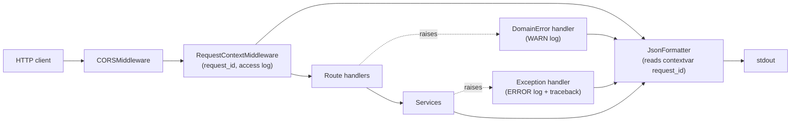

# Logging Implementation Plan

## Decisions (locked)

- **Format**: JSON via a stdlib `logging.Formatter` subclass. No new deps.
- **Scope**: backend + minimal frontend + SQL echo + uvicorn access log unification + docs.
- **Discipline**: every change lands as a `test:` commit followed by `feat:` or `refactor:` per `.cursor/rules/incubyte-tdd-discipline.mdc` and `.cursor/rules/incubyte-commit-hygiene.mdc`.

## Current state (from inventory)

- `app/` has zero usages of `logging`, `logger`, or `print`.
- `scripts/seed.py` has the only stdlib logging in the repo (basicConfig + one INFO line).
- [`app/main.py`](app/main.py) has one handler for `DomainError` only — no `Exception` fallback, no request middleware, no log config.
- [`app/core/config.py`](app/core/config.py) has no `log_level`/`log_sql` settings.
- `frontend/src/` has zero `console.*` calls and no ErrorBoundary; [`frontend/src/lib/api.ts`](frontend/src/lib/api.ts) throws an `ApiError` but does not log.
- `Dockerfile` sets `PYTHONUNBUFFERED=1`. `fly.toml [env]` has no `LOG_LEVEL`.

## Architecture



## What gets created or changed

### Backend — new files

- `app/core/logging.py` — `JsonFormatter`, `configure_logging(level, sql_echo)`, `request_id_var: ContextVar[str | None]`. Idempotent: re-runs do not stack handlers.
- `app/api/middleware/request_context.py` — `RequestContextMiddleware` (Starlette `BaseHTTPMiddleware`): assigns request id, sets contextvar, attaches `X-Request-ID` response header, logs one structured INFO line per request with `method path status duration_ms`. Skips `GET /` health check at INFO (logs at DEBUG) to avoid noise.

### Backend — edits

- [`app/core/config.py`](app/core/config.py): add `log_level: str = "INFO"`, `log_sql: bool = False` (env: `LOG_LEVEL`, `LOG_SQL`).
- [`app/main.py`](app/main.py): call `configure_logging(...)` from the lifespan; add `RequestContextMiddleware` BEFORE `CORSMiddleware` (so CORS stays outermost and short-circuits preflights, request-context wraps every dispatched request); register a global `@app.exception_handler(Exception)` that logs at `ERROR` with traceback and returns `{"detail":"Internal server error","code":"internal_error"}`; add a one-line `WARN` log inside the existing `DomainError` handler with `code`, identifier, and request id.
- [`app/services/employee_service.py`](app/services/employee_service.py): `logger = logging.getLogger(__name__)`; INFO on create / update / delete with safe identifiers only (`employee_id`, `country`, list of changed field *names* — never values, never email, never salary). WARNING when `IntegrityError` is translated to `DuplicateEmployeeEmail` (log a SHA256 prefix of the email — never the raw value).
- [`app/db/session.py`](app/db/session.py): when `settings.log_sql` is true, raise `sqlalchemy.engine` logger to DEBUG (preferred over `engine.echo=True` so it routes through our JSON formatter).
- [`scripts/seed.py`](scripts/seed.py): replace bare `basicConfig` with `configure_logging(...)`; add INFO start log (`count`, `seed`, `reset`) and INFO finish log already exists; expose `--log-level`.
- `Dockerfile`: append `--no-access-log` to the uvicorn `CMD` so we don't double-log; add `ENV LOG_LEVEL=INFO LOG_SQL=false`.
- [`fly.toml`](fly.toml): add `LOG_LEVEL = "INFO"` to `[env]`.

### Frontend — new files

- `frontend/src/lib/logger.ts` — `logger.info|warn|error(message, fields?)`; in prod (`import.meta.env.PROD`) only `warn` and `error` are emitted (and only to `console`); accepts a `requestId` field.
- `frontend/src/components/ErrorBoundary.tsx` — class component; calls `logger.error("react_error_boundary", { error, componentStack })` and renders a fallback card.

### Frontend — edits

- [`frontend/src/lib/api.ts`](frontend/src/lib/api.ts): on non-OK responses, read `X-Request-ID` from the response and `logger.warn("api_error", { method, path, status, requestId })`. Do not log request bodies.
- [`frontend/src/main.tsx`](frontend/src/main.tsx): wrap the app tree in `<ErrorBoundary>` directly under `QueryClientProvider`.

### Tests (TDD-first; new files)

- `tests/unit/test_logging.py` — JsonFormatter emits required fields, includes `request_id` from contextvar, level filtering, idempotent `configure_logging`.
- `tests/integration/test_request_context_middleware.py` — `X-Request-ID` header echoed when supplied, generated when absent; one structured access log per request via `caplog`.
- `tests/integration/test_global_exception_handler.py` — a route that raises a non-domain exception returns `500 {"code":"internal_error"}` and `caplog` captures `ERROR` with traceback and request id.
- `tests/unit/test_employee_service.py` — extend with `caplog` assertions for create/update/delete INFO logs and the duplicate-email WARNING.
- `tests/seed/test_seed_cli.py` — extend to assert start + finish JSON lines.
- `frontend/src/lib/logger.test.ts` — info no-op in prod, warn/error always emit; `requestId` propagates.
- `frontend/src/lib/api.test.ts` — extend (or create) to spy on logger and assert `api_error` is logged with method/path/status/requestId on a 500.
- `frontend/src/components/ErrorBoundary.test.tsx` — child throws, fallback renders, `logger.error` called once.

### Docs

- [`README.md`](README.md): add a "Logging" section (env vars, format example, request-id correlation, how to bump to DEBUG, how to enable SQL echo).
- [`tasks/lessons.md`](tasks/lessons.md): one entry if anything non-obvious surfaced (e.g. middleware ordering vs CORS).

## What is explicitly NOT in scope

- Sentry / Datadog / OpenTelemetry — out of scope for this assessment (note in `artifacts/tradeoffs.md`).
- Log rotation — Fly captures stdout; rotation is the platform's job.
- PII redaction beyond hashing the email on duplicate — services already operate on minimal identifiers.

## Commit cadence (preview of `git log --oneline`)

```
test: configure_logging produces JSON with required fields and is idempotent
feat: add JsonFormatter and configure_logging in app/core/logging.py
test: Settings exposes log_level and log_sql from env
feat: add log_level and log_sql to Settings with safe defaults
test: lifespan calls configure_logging once with settings
feat: wire configure_logging into FastAPI lifespan
test: RequestContextMiddleware emits X-Request-ID and one access log per request
feat: implement RequestContextMiddleware and mount under CORS
test: global Exception handler logs ERROR with traceback and returns internal_error
feat: register global Exception handler with structured log
test: DomainError handler logs WARN with code and identifier
feat: add log call to DomainError handler
test: EmployeeService logs create/update/delete with safe identifiers
feat: add INFO logs in EmployeeService mutations
test: duplicate-email path logs WARN with email hash prefix
feat: add WARN log on DuplicateEmployeeEmail translation
test: LOG_SQL=true raises sqlalchemy.engine logger to DEBUG
feat: route SQL echo through stdlib logging instead of engine.echo
refactor: replace seed basicConfig with configure_logging and add start log
test: frontend logger no-ops info in prod, always emits warn/error
feat: add frontend logger wrapper
test: apiFetch logs api_error with method, path, status, requestId
feat: add api_error log in apiFetch
test: ErrorBoundary renders fallback and logs to logger.error
feat: add ErrorBoundary and mount under QueryClientProvider
chore: add LOG_LEVEL to fly.toml and Dockerfile, drop uvicorn access log
docs: README Logging section
```

## Risks and mitigations

- **Double-logging requests** (uvicorn access + our middleware): mitigated by `--no-access-log` in the uvicorn command.
- **Middleware ordering**: `RequestContextMiddleware` is added BEFORE `CORSMiddleware` so CORS becomes outermost (Starlette adds middleware as a stack — last added is outermost). This keeps CORS short-circuiting OPTIONS preflights without our middleware seeing them, while every dispatched request still gets a request id.
- **Test brittleness**: assert logger name, level, and presence of structured fields via `caplog.records[i].__dict__` — never assert exact rendered strings.
- **PII in logs**: services log identifiers and field *names* only. The duplicate-email path logs a SHA256 prefix of the email. No request bodies are logged anywhere.
- **Performance**: JSON formatting is per-record and cheap; the seed perf budget (5s for 10k) is unaffected because the seed only logs start + finish, not per row.