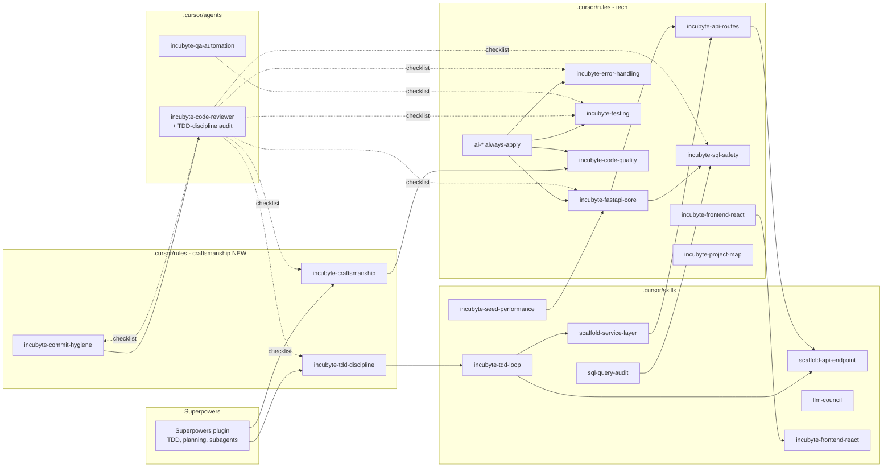

## Goals

- **TDD is the default workflow**, not an option. The agent should never write production code without a failing test first, and every commit should map cleanly to a TDD step. The assessor explicitly evaluates this via `git log`.
- Project-local AI guardrails are FastAPI + SQLAlchemy + SQLite + React/Node-aware, not Django/DRF/multi-tenant/AWS.
- Superpowers (TDD, planning, sub-agents, review, worktrees) drives the workflow; Incubyte rules/skills sit on top and reinforce the Incubyte-specific values (TDD, SOLID, clean code, simple design — sourced from `incubyte.co/inspiration`).
- Every ported asset is renamed `trulla` → `incubyte` and its content scrubbed of Trulla-only references (multi-tenancy, EDI, AWS, schema-per-tenant, Django imports, JD).
- Nothing AWS, no Lambda scaffolding, no `set_schema`, no `*_api_views.py` Django patterns.
- Skills/rules stay short (lean scope). The assessment is a small, single-tenant app for ~10k employees on SQLite.

## Incubyte values encoded as rules

Derived from the assessment instructions and `incubyte.co/inspiration` (Uncle Bob — Three Laws of TDD; Katerina Trajchevska — SOLID; Sandro Mancuso — testing & refactoring; Venkat Subramaniam — code quality; Trisha Gee — code readability):

1. **Three Laws of TDD** (Uncle Bob) — encoded in `incubyte-tdd-discipline.mdc`:
   1. Write no production code except to make a failing test pass.
   2. Write no more of a test than is sufficient to fail (compilation failure counts).
   3. Write no more production code than is sufficient to make the failing test pass.
2. **SOLID + Clean Code + Simple Design** — encoded in `incubyte-craftsmanship.mdc` (SRP/OCP/LSP/ISP/DIP, intention-revealing names, small functions, four rules of simple design, YAGNI/DRY/KISS, readability over cleverness).
3. **Small atomic commits showing TDD evolution** — encoded in `incubyte-commit-hygiene.mdc`:
   - One commit per TDD phase: `test: RED — <behavior>` / `feat: GREEN — <minimal impl>` / `refactor: <description>`.
   - Conventional Commits (`feat:`, `fix:`, `test:`, `refactor:`, `chore:`, `docs:`).
   - Never bundle unrelated changes; never commit broken tests except as a deliberate RED step.
4. **Tests before refactoring legacy** (Sandro Mancuso) — `incubyte-testing.mdc` notes that any refactor of untested code requires a characterization test first.

## Target `.cursor/` layout

```
.cursor/
├── settings.json                  # already exists (Superpowers enabled) — leave as-is
├── mcp.json                       # OMITTED (rely on user-level MCPs)
├── agents/
│   ├── incubyte-code-reviewer.md  # adds TDD-discipline + commit-hygiene checklist sections
│   └── incubyte-qa-automation.md  # writes scenarios to tasks/manual-test-scenarios.md
├── plans/                         # empty (populated by plan mode)
├── rules/
│   ├── README.md
│   ├── ai-shortcuts.mdc                # incubyte-renamed; adds RED/GREEN/REFACTOR/TDD shortcuts
│   ├── ai-standards.mdc                # verbatim
│   ├── ai-workflow.mdc                 # verbatim
│   ├── incubyte-tdd-discipline.mdc     # NEW — Three Laws of TDD (always-apply)
│   ├── incubyte-craftsmanship.mdc      # NEW — SOLID, clean code, simple design (always-apply)
│   ├── incubyte-commit-hygiene.mdc     # NEW — small commits, conventional msgs, RED/GREEN/REFACTOR (always-apply)
│   ├── incubyte-fastapi-core.mdc       # ← from trulla-django-core
│   ├── incubyte-api-routes.mdc         # ← from trulla-api-views (FastAPI routers/dependencies)
│   ├── incubyte-code-quality.mdc       # ← from trulla-code-quality (de-Django-ified)
│   ├── incubyte-error-handling.mdc     # ← from trulla-error-handling (FastAPI HTTPException)
│   ├── incubyte-sql-safety.mdc         # ← from trulla-sql-security (SQLAlchemy + parameterized)
│   ├── incubyte-testing.mdc            # ← from trulla-testing (pytest + Vitest/Jest, TDD-first)
│   ├── incubyte-frontend-react.mdc     # NEW (React + Vite + RTL, Stitch/Figma design source)
│   └── incubyte-project-map.mdc        # skeleton (filled in after Step 1 of the actual build)
└── skills/
    ├── llm-council/SKILL.md             # ← verbatim, only update file-reference paths
    ├── incubyte-tdd-loop/SKILL.md       # NEW — one-screen RED→GREEN→REFACTOR→COMMIT recipe
    ├── scaffold-api-endpoint/SKILL.md   # ← rewritten for FastAPI router + Pydantic schema (test-first)
    ├── scaffold-service-layer/SKILL.md  # ← rewritten without set_schema, AppResponse (test-first)
    ├── sql-query-audit/SKILL.md         # ← rewritten for SQLAlchemy text()/raw SQL
    ├── incubyte-fastapi-core/SKILL.md   # short companion to the rule
    ├── incubyte-errors/SKILL.md         # ← from trulla-errors
    ├── incubyte-testing/SKILL.md        # ← from trulla-testing
    ├── incubyte-code-quality/SKILL.md   # ← from trulla-code-quality
    ├── incubyte-frontend-react/SKILL.md # NEW (Vite+React+Vitest patterns)
    └── incubyte-seed-performance/SKILL.md # NEW — directly addresses PDF: "performance of the seed script matters"
```

Plus non-`.cursor` companion files referenced by rules and required by the PDF:

- `AGENTS.md` — short project overview (stack, agent roles, layout)
- `tasks/todo.md`, `tasks/lessons.md`, `tasks/manual-test-scenarios.md` — skeletons required by `ai-workflow.mdc` and the QA agent
- `artifacts/README.md` — index file for the PDF-required artifacts (planning/design notes, architecture diagrams, AI prompts used, trade-off explanations, performance considerations); empty subfolders are created as the work progresses

## What is intentionally NOT ported

- `trulla-multi-tenancy.mdc`, `trulla-sql-tenancy/` skill — single tenant
- `lambda-scaffold/`, AWS MCPs (`cloudwatch`, `sns-sqs`, `lambda-tool`) — no AWS
- `trulla-mcp-postgres-analysis/` — using SQLite
- `migrate-legacy-tests/` — greenfield
- `scaffold-management-command/` — no Django mgmt commands; FastAPI CLI is overkill here
- `trulla-drf-api/` — no DRF
- `trulla/.cursor/mcp.json` postgres helper script — N/A
- `awslabs.aws-documentation-mcp-server` from user level is left alone but unused

## MCP strategy

Keep `.cursor/mcp.json` minimal or omit. The user already has these enabled at user level which are sufficient:

- `user-context7` — primary docs lookup for FastAPI, SQLAlchemy, React, Vite, Faker
- `user-figma` — for ingesting Google Stitch → Figma designs into code
- `user-github` — repo ops
- `user-Sentry` — optional, only if observability is added

If the user wants a project-level entry, the only reasonable candidate is the `figma` MCP scoped to this project, but it is redundant with user level. **Recommendation: omit project-level `mcp.json` and rely on user MCPs.**

## Hooks

Superpowers ships its own `sessionStart` hook (visible in the plugin info). No project-specific hooks are needed.

## Key content adaptations (highlights, not full text)

### Craftsmanship / TDD rules (NEW, always-apply)

- **`incubyte-tdd-discipline.mdc`**: opens with Uncle Bob's Three Laws (verbatim), states the agent MUST run the failing test and show it fail before writing implementation, and forbids writing more production code than the failing test demands. References the assessment video (`https://www.youtube.com/watch?v=qkblc5WRn-U`) and `incubyte.co/inspiration`. Includes a "what counts as a test" table (unit ≫ integration ≫ E2E) and an explicit anti-pattern list (writing tests after, mocking everything, skipping the RED step).
- **`incubyte-craftsmanship.mdc`**: SOLID with a one-line example per principle; the four rules of simple design (passes tests, reveals intent, no duplication, fewest elements); YAGNI/DRY/KISS; intention-revealing names; small functions/classes; commands vs queries; pure-where-possible; tells-don't-ask; readability before cleverness. Cites Trajchevska (SOLID), Mancuso (testing & refactoring), Subramaniam (code quality), Gee (reading code).
- **`incubyte-commit-hygiene.mdc`**: Conventional Commits format; one logical change per commit; commits map to TDD steps with a recommended message style:
  - `test: add failing test for <behavior>` (RED)
  - `feat: implement <behavior> to pass test` (GREEN)
  - `refactor: <what improved, why>` (REFACTOR — tests still green)
  - `chore:`/`docs:` allowed for non-behavioral changes
  - Never bundle test + impl + refactor into one commit; never amend a public commit; never commit `.env`/secrets.

### Tech rules

- `ai-shortcuts.mdc`: scrub trulla references; add a `TDD:` / `RED:` / `GREEN:` / `REFACTOR:` shortcut family that triggers the `incubyte-tdd-loop` skill; keep AUDIT, REFACTOR, TESTS, BUG, SEC, ULTRA, DELPHI, COUNCIL.
- `incubyte-fastapi-core.mdc`: stack is FastAPI + SQLAlchemy 2.x + Pydantic v2 + Alembic (optional) + SQLite; layered architecture (`app/api/routes/` → `app/services/` → `app/models/` + `app/schemas/`); transactional units via `with Session.begin():`; thin route handlers.
- `incubyte-api-routes.mdc`: `APIRouter`, `Depends(get_db)`, Pydantic request/response models, `response_model=`, `HTTPException(status_code=...)`, dependency-injected services.
- `incubyte-sql-safety.mdc`: never f-string user data into `text()`; use `:named` bound params; ORM by default; explicit query review when raw SQL is unavoidable.
- `incubyte-error-handling.mdc`: `HTTPException`, custom exception handlers, structured `{detail, code}` payloads, no bare `except Exception`, log with context.
- `incubyte-testing.mdc`: pytest + `TestClient`/`httpx.AsyncClient`; SQLAlchemy test DB via in-memory SQLite or `tmp_path`; Vitest + RTL for React; **TDD red-green-refactor is the default for all new code**, mirroring Superpowers `test-driven-development` skill and `incubyte-tdd-discipline.mdc`. Coverage target ≥ 90% on changed modules; characterization test required before refactoring untested code (Mancuso).
- `incubyte-frontend-react.mdc`: React 18 + Vite + TypeScript; component library TBD (e.g., shadcn/ui or MUI); design source = Google Stitch → Figma; testing with Vitest + React Testing Library; component tests live next to the component.

### Skills

- **`incubyte-tdd-loop/SKILL.md`** (NEW): one-screen recipe the agent reads at the start of every feature task:
  1. Write the smallest failing test (RED). Run it. Paste the failure output.
  2. `git add` + commit with `test: ...`.
  3. Write the minimum code to make it pass (GREEN). Run it. Paste the pass.
  4. `git add` + commit with `feat: ...`.
  5. Refactor (REFACTOR). Re-run all tests. Commit `refactor: ...` if anything changed.
  6. Loop back to step 1 for the next behavior.
- `incubyte-seed-performance/SKILL.md`: PDF perf mapping — batched inserts via `Session.execute(insert(Employee), [...])` or `bulk_insert_mappings`, single transaction, disable autoflush, optional SQLite `PRAGMA journal_mode=WAL` / `PRAGMA synchronous=NORMAL` for the duration of the seed, deterministic `random.seed()`, idempotency via truncate-or-skip flag, benchmark target (e.g., 10k rows < 5s on dev laptop), document the chosen approach as a trade-off in `artifacts/`.
- Other ported skills: as previously described, with every "write test" step explicitly preceding the implementation step.

### Agents

- **`incubyte-code-reviewer.md`**: checklist rewritten for FastAPI/Pydantic/SQLAlchemy (input validation, `response_model` coverage, dependency leaks, N+1 via `selectinload`, transactional boundaries, secret handling, test coverage ≥ 90%) AND adds two new sections:
  - **TDD Discipline (git log audit)**: `git log --oneline` shows alternating `test:` → `feat:` patterns; no production code arrives without a preceding failing test; no commit mixes tests + impl + refactor; characterization tests precede refactors of untested code.
  - **Craftsmanship**: SOLID adherence on touched modules, dead code removed, magic numbers extracted, function size, naming, simple-design rules.
- **`incubyte-qa-automation.md`**: Phases 1–5 only; **Phase 6 = write scenarios to `tasks/manual-test-scenarios.md`** instead of Jira.

### Artifacts folder (PDF requirement)

`artifacts/README.md` lists, with empty placeholders, the deliverables the PDF mentions:

- `planning/` — design notes, decisions
- `architecture/` — diagrams (mermaid or PNG)
- `prompts/` — notable AI prompts and how they shaped the solution
- `tradeoffs.md` — explicit decisions (why FastAPI, why SQLite, why bulk_insert_mappings, etc.)
- `performance.md` — seed script benchmark, query plans, optimization log
- `demo/` — placeholder for the video link / GIFs

## Out of scope for this setup task

- Actually scaffolding the Salary Management app (backend, frontend, seed script, models).
- Writing any feature code, migrations, or tests.
- Designing the data model — happens once you say "go" in a follow-up session.

## Mermaid: how the assets relate


