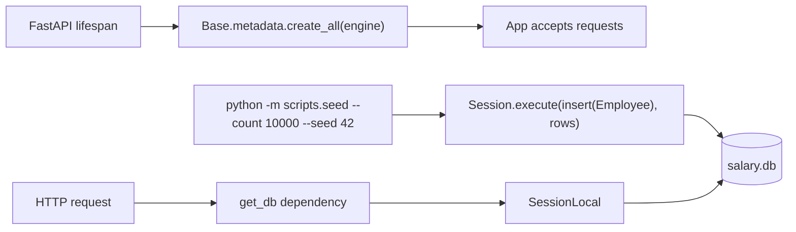
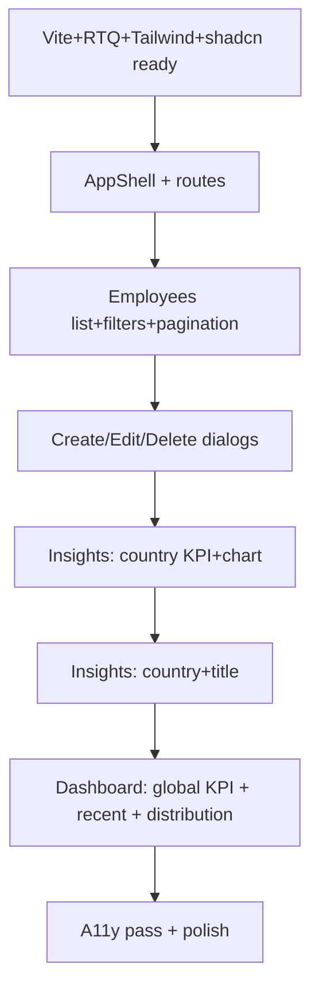

# Salary Management — Implementation Execution Plan

> Authoritative reference for all future development work. Optimized to be followed top-to-bottom with `tasks/todo.md` mirroring the active phase. Every micro-task = one RED, one GREEN, one optional REFACTOR, one commit. Cross-cutting rules live in [.cursor/rules/](.cursor/rules/) and are non-negotiable.

---

## 0. Operating Model (read once, then re-read at every phase boundary)

### 0.1 Core rhythm (per micro-task)

1. **RED** — write the smallest failing test (one assertion). Run it. Paste the failure.
2. **Commit** `test: …`.
3. **GREEN** — minimum code to pass. Run full suite. Paste the pass.
4. **Commit** `feat:` / `fix:`.
5. **REFACTOR** (optional) — tests stay green; no new behavior.
6. **Commit** `refactor: …` (skip if nothing changed).
7. **60-second artifact audit** per [.cursor/skills/incubyte-tdd-loop/SKILL.md](.cursor/skills/incubyte-tdd-loop/SKILL.md) Step 9.
8. Update [tasks/todo.md](tasks/todo.md); append to [tasks/lessons.md](tasks/lessons.md) only if something surprised you.

### 0.2 Mode policy (per micro-task)

| Mode | Use when |
|---|---|
| **Plan** | Phase boundaries, multi-file changes, design tradeoffs, or task touches >3 files. |
| **Ask** | Pure read/explore (audit `git log`, inspect a query, read coverage). |
| **Agent** | Default for executing a single micro-task once the design is settled. |
| **Debug** | Any RED that fails for the wrong reason, any GREEN that pulls in regressions, or any test that becomes flaky. |

### 0.3 Definition of Done per micro-task

- [ ] RED commit shows the test failing for the right reason
- [ ] GREEN commit makes it pass without breaking other tests
- [ ] No `print`, no `TODO: revert`, no commented-out code
- [ ] Coverage on changed modules ≥ 90% (`pytest --cov=app --cov-report=term-missing`)
- [ ] [tasks/todo.md](tasks/todo.md) sub-task checked off
- [ ] Artifact audit done (most commits add nothing; that is correct)

### 0.4 What this plan deliberately does NOT do (anti-overengineering)

- No authentication / authorization (PDF excludes it)
- No Alembic migrations — `Base.metadata.create_all(bind=engine)` on startup is sufficient for SQLite single-tenant
- No multi-tenancy, no schema switching, no DRF, no microservices
- No global state stores on the frontend (Redux/Zustand) — TanStack Query handles server state, React state handles UI
- No snapshot tests, no Storybook
- No Docker Compose / Kubernetes — single-process deploy (Render / Fly.io / Railway), documented in [artifacts/tradeoffs.md](artifacts/tradeoffs.md)
- No premature abstractions: no generic `BaseRepository<T>`, no service factories, no event bus, no DDD aggregates
- No virtualization on the employee table unless TanStack Table profiling proves it's needed at 10k rows
- No CI pipeline beyond a simple GitHub Actions `pytest && npm run test` on push (set up only if there's time)

### 0.5 Folder evolution by phase

```
Phase 0:    .venv/ (gitignored) · .python-version · frontend/.nvmrc · (no source files yet)
Phase 1:    app/main.py · app/core/ · app/db/ · tests/conftest.py · pyproject.toml · data/
Phase 2:    + app/models/ · app/schemas/ · app/repositories/ · app/services/ · app/api/routes/employees.py
Phase 3:    + app/services/salary_insights_service.py · app/api/routes/insights.py
Phase 4:    + app/db/seed.py · scripts/seed.py · scripts/benchmark_seed.py
Phase 5:    + frontend/ (Vite + RTQ provider + services layer + shadcn primitives)
Phase 6–8:  + frontend/src/components/{employees,analytics,dashboard,layout}/ · src/pages/
Phase 9–13: + .github/workflows/ · Dockerfile (optional) · artifacts/demo/
```

### 0.6 Phase 0 — Environment Bootstrap & Preflight (run before any TDD loop)

**Goal**: every session begins with a verified development environment (Python venv + Node toolchain + the full required stack installed). No RED → GREEN cycle starts on a broken or partial environment.

**Hard rule**: if any "Verify" command below fails or reports `MISSING`, install the missing piece **before** opening the editor. Do not write code against a half-installed stack.

#### 0.6.1 One-time setup (per machine; re-verify on every fresh clone)

| # | Step | Command | Verify | Mode |
|---|---|---|---|---|
| 0.1 | Python 3.11+ on PATH | `python3 --version` | prints `3.11.x` or higher | Ask |
| 0.2 | Create venv at `.venv/` | `python3 -m venv .venv` | `.venv/bin/python` exists | Agent |
| 0.3 | `.venv/` in `.gitignore` | `rg "^\.venv/?$" .gitignore` | match found (already added) | Ask |
| 0.4 | Activate venv + upgrade pip + wheel | `source .venv/bin/activate && pip install -U pip wheel` | `which pip` resolves under `.venv/bin/` | Agent |
| 0.5 | Node 20.x LTS on PATH | `node --version` | `v20.x` | Ask |
| 0.6 | npm 10.x on PATH | `npm --version` | `10.x` | Ask |
| 0.7 | (Optional) pin toolchain | `echo 3.11 > .python-version`, `echo 20 > frontend/.nvmrc` | files exist | Agent |

Commit only files actually added to the repo (e.g. `.python-version`, `.nvmrc`): `chore: pin python 3.11 and node 20`.

#### 0.6.2 Required Backend Stack (verified BEFORE Phase 1.1)

| Package | Min Version | Purpose |
|---|---|---|
| `fastapi` | 0.110+ | web framework |
| `uvicorn[standard]` | 0.27+ | ASGI server |
| `sqlalchemy` | 2.0+ | ORM (2.x typed style) |
| `pydantic` | 2.5+ | validation |
| `pydantic-settings` | 2.1+ | env-driven config |
| `pytest` | 8.0+ | test runner |
| `pytest-cov` | 4.1+ | coverage gate (`--cov=app`) |
| `pytest-randomly` | 3.15+ | order-randomized tests |
| `httpx` | 0.27+ | FastAPI `TestClient` HTTP layer |

**Verify in one shot** (run after `source .venv/bin/activate`):

```bash
python - <<'PY'
import importlib.util, sys
required = [
    "fastapi", "uvicorn", "sqlalchemy", "pydantic", "pydantic_settings",
    "pytest", "httpx", "pytest_cov", "pytest_randomly",
]
missing = [m for m in required if importlib.util.find_spec(m) is None]
print("missing:", missing or "none")
sys.exit(1 if missing else 0)
PY
```

**If `missing` is non-empty, install BEFORE proceeding to Phase 1**:

```bash
# Preferred (once Phase 1.1 has created pyproject.toml):
pip install -e ".[dev]"

# One-off bootstrap during Phase 1.1 itself:
pip install "fastapi>=0.110" "uvicorn[standard]>=0.27" \
            "sqlalchemy>=2.0" "pydantic>=2.5" "pydantic-settings>=2.1" \
            "pytest>=8" "pytest-cov>=4.1" "pytest-randomly>=3.15" "httpx>=0.27"
```

Re-run the verify block until it prints `missing: none`. Then — and only then — start Phase 1.1.

#### 0.6.3 Required Frontend Stack (verified BEFORE Phase 5.1)

| Package | Min Version | Purpose |
|---|---|---|
| `react`, `react-dom` | 18.2+ | UI runtime |
| `vite`, `@vitejs/plugin-react` | 5.x | bundler / dev server |
| `typescript` | 5.3+ | language (strict mode) |
| `tailwindcss`, `postcss`, `autoprefixer` | 3.4 / latest | styling |
| `@tanstack/react-query` | 5.x | server state |
| `@tanstack/react-table` | 8.x | tables |
| `recharts` | 2.x | charts |
| `react-router-dom` | 6.x | routing |
| `react-hook-form` | 7.x | forms |
| `zod`, `@hookform/resolvers` | 3.x | schema validation |
| `vitest` | 1.x | test runner |
| `@testing-library/react` | 14.x | component tests |
| `@testing-library/user-event` | 14.x | interaction events |
| `@testing-library/jest-dom` | 6.x | DOM matchers |
| `jsdom` | 24.x | test DOM environment |
| `@types/node` | latest | types |
| `shadcn/ui` CLI | latest | invoked via `npx shadcn@latest …` |

**Verify in one shot** (run from `frontend/` after Phase 5.1 has created `package.json`):

```bash
cd frontend
node -v && npm -v
required=(
  react react-dom vite typescript tailwindcss
  @tanstack/react-query @tanstack/react-table recharts react-router-dom
  react-hook-form zod @hookform/resolvers
  vitest @testing-library/react @testing-library/user-event @testing-library/jest-dom jsdom
)
for pkg in "${required[@]}"; do
  npm ls "$pkg" --depth=0 >/dev/null 2>&1 || echo "MISSING: $pkg"
done
```

**If anything prints `MISSING`, install BEFORE continuing**:

```bash
cd frontend
npm install <missing-runtime-pkg>        # for runtime deps
npm install -D <missing-dev-pkg>         # for test / dev deps
```

Re-run the verify loop until no `MISSING:` lines print. Then start Phase 5.x.

#### 0.6.4 Recurring Preflight (run at the start of every session)

Before any RED / GREEN / REFACTOR step, paste this into the terminal:

```bash
# Backend preflight
source .venv/bin/activate || { echo "venv missing — Phase 0.2"; return 1; }
python -c "import fastapi, sqlalchemy, pydantic, pytest, httpx" 2>&1 \
  || { echo "stack drift — reinstall: pip install -e '.[dev]'"; return 1; }
pytest -q --collect-only >/dev/null && echo "backend: READY"

# Frontend preflight (only when about to touch frontend/)
( cd frontend && node -v >/dev/null && npm ls --depth=0 >/dev/null ) \
  && echo "frontend: READY"
```

If either line prints anything other than `READY`, **stop**: install or fix the toolchain first.

#### 0.6.5 Commit pattern for Phase 0

Phase 0 mostly produces no source commits — it is environment work outside the repo. Acceptable commits:

| Action | Commit |
|---|---|
| Confirm `.venv/` and `frontend/node_modules/` are gitignored (already in `.gitignore`) | none (no diff) |
| Pin toolchain versions | `chore: pin python 3.11 and node 20` |
| Add `pyproject.toml` with the verified backend stack | this **is** Phase 1.1 — `chore: add pyproject with verified backend stack` |
| Add `frontend/package.json` with the verified frontend stack | this **is** Phase 5.1 — `chore(frontend): scaffold package.json with verified stack` |

#### 0.6.6 Definition of Done for Phase 0

- [ ] `.venv/` exists and is activated in the current shell
- [ ] Backend verify script prints `missing: none`
- [ ] (If frontend phase is next) frontend verify loop prints no `MISSING:` lines
- [ ] `.venv/` and `frontend/node_modules/` are gitignored (re-confirmed)
- [ ] Preflight one-liner (§0.6.4) prints `backend: READY` (and `frontend: READY` when applicable)

---

## 1. Phase Sequence (execution order)

| # | Phase | Outcome | Estimated micro-tasks |
|---|---|---|---|
| 0 | Environment bootstrap & preflight | `.venv` activated; backend + frontend stacks verified or installed; preflight one-liner prints READY | 5–7 (mostly verification) |
| 1 | Backend foundation | App boots, DB session works, error handlers registered | 8–10 |
| 2 | Employee domain CRUD | `/employees` POST/GET/PUT/DELETE pass tests end-to-end | 18–24 |
| 3 | Salary insights | min/max/avg by country, avg by (country, title) | 12–16 |
| 4 | Seed script | 10k rows < 5s, deterministic, idempotent | 8–10 |
| 5 | Frontend foundation | Vite + TS strict + Tailwind + shadcn + RTQ + Vitest wired | 6–8 |
| 6 | Employees UI | List + create + edit + delete dialogs working against API | 14–20 |
| 7 | Insights UI | Country and (country, title) charts + KPI cards | 10–14 |
| 8 | Dashboard | Landing page with KPI grid + recent employees | 6–8 |
| 9 | Cross-cutting hardening | Pagination defaults, query perf, a11y pass | 6–10 |
| 10 | QA + code-reviewer pass | Coverage ≥90%, manual scenarios written | 4–6 |
| 11 | Documentation + artifacts | README, tradeoffs, prompts, performance complete | 3–5 |
| 12 | Deployment | Single-process deploy live with public URL | 4–6 |
| 13 | Demo recording | 2–3 min video, README links updated | 2–3 |

---

## 2. Backend Roadmap (Phases 1–4)

### Phase 1 — Backend foundation

| # | Objective | Files | Prereqs | Test(s) | Commit examples | Mode |
|---|---|---|---|---|---|---|
| 1.1 | Initialize `pyproject.toml` with deps (pinned to versions verified in §0.6.2) | `pyproject.toml`, `.gitignore` | Phase 0 (§0.6.2 prints `missing: none`) | n/a (chore) | `chore: add pyproject with verified backend stack` | Agent |
| 1.2 | Empty FastAPI app boots | [app/main.py](app/main.py), [tests/integration/test_health.py](tests/integration/test_health.py), [tests/conftest.py](tests/conftest.py) | 1.1 | `test_root_returns_200` | `test: root endpoint returns 200` → `feat: bootstrap FastAPI app with / health route` | Agent |
| 1.3 | Settings via `pydantic-settings` | [app/core/config.py](app/core/config.py), `tests/unit/test_config.py` | 1.2 | `test_settings_reads_database_url_from_env` | `test: Settings loads DATABASE_URL` → `feat: add Settings via pydantic-settings` | Agent |
| 1.4 | `Base` + engine + `get_db()` | [app/db/base.py](app/db/base.py), [app/db/session.py](app/db/session.py) | 1.3 | `test_get_db_yields_session_and_closes` | `test: get_db yields a Session and closes it` → `feat: add SQLAlchemy Base, engine, get_db dependency` | Agent |
| 1.5 | In-memory SQLite test fixture | [tests/conftest.py](tests/conftest.py) | 1.4 | `test_db_fixture_returns_clean_session` | `test: db fixture is empty and per-test` → `feat: add engine/db/client fixtures` | Agent |
| 1.6 | Domain exception base + handler | [app/core/exceptions.py](app/core/exceptions.py), `app/main.py` | 1.2 | `test_domainerror_is_mapped_to_500_with_code` | `test: DomainError maps to 500 with code` → `feat: register global DomainError handler` | Agent |
| 1.7 | Lifespan creates tables on startup | `app/main.py` | 1.4 | `test_tables_exist_after_app_startup` | `test: startup creates schema` → `feat: create tables in lifespan` | Agent |
| 1.8 | CORS middleware for `http://localhost:5173` | `app/main.py`, `app/core/config.py` | 1.7 | `test_cors_preflight_for_frontend_origin` | `test: CORS allows frontend origin` → `feat: enable CORS for local frontend` | Agent |

**Refactor checkpoint after Phase 1**: confirm `app/` matches [.cursor/rules/incubyte-project-map.mdc](.cursor/rules/incubyte-project-map.mdc) skeleton; rename if drift exists. Run [.cursor/agents/incubyte-code-reviewer.md](.cursor/agents/incubyte-code-reviewer.md) checklist sections 1–3.

### Phase 2 — Employee domain (CRUD)

The data shape (final): `id` (PK), `full_name` (≤200), `job_title` (≤100), `country` (ISO-2, 2 chars), `salary` (`Numeric(12,2)` ≥0), `email` (unique, optional), `department` (≤80, optional), `hire_date` (date, optional), `is_active` (bool, default true), timestamps. Build incrementally — start with the minimal columns the first test demands.

| # | Objective | Files | Prereqs | Test(s) | Commit examples | Mode |
|---|---|---|---|---|---|---|
| 2.1 | `Employee` model with required fields only | [app/models/employee.py](app/models/employee.py) | 1.x | `test_employee_table_created` | `test: Employee table is created` → `feat: add Employee model (name, title, country, salary)` | Agent |
| 2.2 | `EmployeeCreate`/`EmployeeRead` Pydantic v2 schemas | [app/schemas/employee.py](app/schemas/employee.py) | 2.1 | `test_employee_create_rejects_negative_salary`, `test_employee_create_requires_iso2_country` | `test: schema rejects negative salary` → `feat: add EmployeeCreate/Read schemas` | Agent |
| 2.3 | `EmployeeRepository.add` + `get` | [app/repositories/employee_repository.py](app/repositories/employee_repository.py) | 2.1 | `test_add_persists_employee`, `test_get_returns_none_when_missing` | `test: repository add persists` → `feat: implement EmployeeRepository.add/get` | Agent |
| 2.4 | `EmployeeService.create` (commit at boundary) | [app/services/employee_service.py](app/services/employee_service.py) | 2.3 | `test_service_create_returns_persisted_employee` | `test: service.create returns persisted Employee` → `feat: implement EmployeeService.create` | Agent |
| 2.5 | `POST /employees` integration | [app/api/routes/employees.py](app/api/routes/employees.py), `app/main.py` | 2.4 | `test_create_employee_returns_201_with_persisted_row` | `test: POST /employees returns 201` → `feat: implement POST /employees endpoint` | Agent |
| 2.6 | 422 on invalid payload | `tests/integration/test_employees_api.py` | 2.5 | `test_create_employee_with_negative_salary_returns_422` | `test: invalid salary returns 422` → (no impl change; Pydantic already catches) | Ask + Agent |
| 2.7 | `GET /employees/{id}` happy path | route + service + repo | 2.5 | `test_get_employee_by_id_returns_200` | `test: GET /employees/{id} returns 200` → `feat: implement GET /employees/{id}` | Agent |
| 2.8 | `EmployeeNotFound` → 404 | [app/core/exceptions.py](app/core/exceptions.py), `app/main.py`, service | 2.7 | `test_get_employee_returns_404_when_missing` | `test: missing employee returns 404` → `feat: map EmployeeNotFound to 404` | Agent |
| 2.9 | `GET /employees` empty list | route | 2.5 | `test_list_employees_returns_empty_list` | `test: list returns []` → `feat: implement GET /employees returning []` | Agent |
| 2.10 | `GET /employees` returns inserted rows | route + repo `.list()` | 2.9 | `test_list_employees_returns_inserted_rows` | `test: list returns inserted rows` → `feat: implement EmployeeRepository.list` | Agent |
| 2.11 | Pagination `limit`/`offset` clamped | route | 2.10 | `test_list_paginates_with_limit_and_offset`, `test_list_clamps_limit_to_500` | `test: list paginates` → `feat: add limit/offset with clamps` | Agent |
| 2.12 | Filter `?country=` | route + repo | 2.10 | `test_list_filters_by_country` | `test: list filters by country` → `feat: add country filter to /employees` | Agent |
| 2.13 | `PUT /employees/{id}` partial update | route + service + `EmployeeUpdate` schema | 2.7 | `test_update_employee_persists_changes`, `test_update_missing_returns_404` | `test: PUT updates fields` → `feat: implement PUT /employees/{id}` | Agent |
| 2.14 | `DELETE /employees/{id}` returns 204 | route + service | 2.13 | `test_delete_employee_returns_204`, `test_delete_missing_returns_404` | `test: DELETE returns 204` → `feat: implement DELETE /employees/{id}` | Agent |
| 2.15 | Optional fields: `email` (unique) + `DuplicateEmployeeEmail` → 409 | model + schema + service + handler | 2.14 | `test_create_with_duplicate_email_returns_409` | `test: duplicate email returns 409` → `feat: enforce unique email with 409 mapping` | Agent |
| 2.16 | Optional fields: `department`, `hire_date`, `is_active` (default true) | model + schema | 2.15 | `test_create_defaults_is_active_true`, `test_create_persists_hire_date` | `test: defaults is_active true` → `feat: add department/hire_date/is_active` | Agent |
| 2.17 | Filter `?q=` (full_name `ILIKE`/`LOWER LIKE`) | route + repo | 2.12 | `test_list_filters_by_name_substring` | `test: ?q filters by name substring` → `feat: add case-insensitive name search` | Agent |
| 2.18 | Sort `?sort=salary,-hire_date` allow-list | route + repo | 2.17 | `test_list_sorts_by_salary_asc`, `test_unknown_sort_returns_422` | `test: sort by salary asc` → `feat: add allow-listed sort param` | Agent |

**Refactor checkpoints in Phase 2**:
- After 2.5: extract `_to_read(employee)` helper if `model_validate` is repeated.
- After 2.14: extract `EmployeeService._get_or_raise` helper used by get/update/delete.
- After 2.18: confirm repository has no business logic; service has no SQL.

### Phase 3 — Salary insights

| # | Objective | Files | Prereqs | Test(s) | Commit examples | Mode |
|---|---|---|---|---|---|---|
| 3.1 | `SalaryInsightsService.average_by_country` returns `Decimal("0.00")` when empty | [app/services/salary_insights_service.py](app/services/salary_insights_service.py) | 2.1 | `test_average_salary_by_country_returns_zero_when_no_employees` | `test: avg by country returns 0 when empty` → `feat: implement average_salary_by_country` | Agent |
| 3.2 | Compute mean for a country (excludes other countries) | service | 3.1 | `test_average_salary_by_country_excludes_other_countries` | `test: avg excludes other countries` → `feat: filter by country in aggregate` | Agent |
| 3.3 | `min_by_country` / `max_by_country` | service | 3.2 | `test_min_max_salary_by_country` | `test: min/max by country` → `feat: add min/max aggregates` | Agent |
| 3.4 | `average_by_country_and_title` | service | 3.3 | `test_average_by_country_and_title_filters_both` | `test: avg by country+title` → `feat: avg by country and job title` | Agent |
| 3.5 | `GET /insights/country/{code}` returns `{min,max,avg,count}` | [app/api/routes/insights.py](app/api/routes/insights.py), schemas | 3.3 | `test_insights_country_returns_payload_shape` | `test: /insights/country returns shape` → `feat: add insights country endpoint` | Agent |
| 3.6 | 422 when country is malformed | route | 3.5 | `test_insights_country_rejects_3_letter_code` | `test: bad country returns 422` → (Pydantic) | Agent |
| 3.7 | `GET /insights/country/{code}/title/{title}` | route | 3.4, 3.5 | `test_insights_country_title_returns_avg` | `test: /insights/country/title returns avg` → `feat: add title-scoped endpoint` | Agent |
| 3.8 | "Other meaningful metrics" (one or two — keep YAGNI) — proposed: top 5 titles by avg salary in a country; salary distribution histogram buckets | service + route + schema | 3.7 | `test_top_titles_returns_sorted_by_avg_desc`, `test_distribution_groups_by_band` | `test: top titles by avg salary` → `feat: add top-titles insight` | Plan first, then Agent |
| 3.9 | `selectinload` not needed (no relations yet) — confirm N+1 absent | n/a | 3.5 | `test_insights_country_uses_single_query` (asserts query count via SQLAlchemy event) | `test: insights endpoint uses 1 query` → (no impl) | Debug if violated |

**LLM Council checkpoint before 3.8**: decide which "other meaningful metric" justifies the cost. Run [.cursor/skills/llm-council/SKILL.md](.cursor/skills/llm-council/SKILL.md) with prompt `COUNCIL: which 1–2 metrics most help an HR manager beyond min/max/avg?`. Persist outcome in [artifacts/prompts/council-extra-metrics.md](artifacts/prompts/council-extra-metrics.md).

### Phase 4 — Seed script (PDF-critical: "performance matters")

Follow [.cursor/skills/incubyte-seed-performance/SKILL.md](.cursor/skills/incubyte-seed-performance/SKILL.md).

| # | Objective | Files | Prereqs | Test(s) | Commit examples | Mode |
|---|---|---|---|---|---|---|
| 4.1 | Drop `data/first_names.txt` + `data/last_names.txt` | `data/` | none | `test_seed_data_files_exist` | `chore: vendor first/last name lists from PDF` | Agent |
| 4.2 | `seed(db, count=N)` inserts N rows | [app/db/seed.py](app/db/seed.py) | 2.1, 4.1 | `test_seed_inserts_expected_row_count` | `test: seed inserts N rows` → `feat: implement seed via Session.execute(insert)` | Agent |
| 4.3 | Deterministic with `seed=42` | seed | 4.2 | `test_seed_is_deterministic_with_seed` | `test: same seed → same first row` → `feat: accept seed parameter` | Agent |
| 4.4 | Names sampled only from provided files | seed | 4.2 | `test_seed_uses_only_provided_first_names` | `test: first names are from file` → `feat: load names from data/` | Agent |
| 4.5 | `--reset` truncates first | seed + CLI | 4.2 | `test_seed_reset_clears_table`, `test_seed_without_reset_raises_if_not_empty` | `test: --reset truncates` → `feat: add reset flag with safe default` | Agent |
| 4.6 | CLI entry-point | [scripts/seed.py](scripts/seed.py) | 4.5 | `test_seed_cli_invokes_with_args` (via `subprocess`) | `test: scripts.seed CLI` → `feat: add CLI for seed` | Agent |
| 4.7 | Perf budget test (opt-in `pytest -m perf`) | `tests/seed/test_seed_performance.py`, `pyproject.toml` (marker) | 4.2 | `test_seed_performance_budget_under_5s` | `test: seed 10k under 5s` → (likely already passes; confirm with bulk insert) | Agent |
| 4.8 | Benchmark harness + record | [scripts/benchmark_seed.py](scripts/benchmark_seed.py), [artifacts/performance.md](artifacts/performance.md) | 4.7 | n/a (perf log) | `perf: record 10k seed time` + `docs(artifacts): performance entry` | Agent |
| 4.9 | If >5s: try `PRAGMA journal_mode=WAL`, document in [artifacts/tradeoffs.md](artifacts/tradeoffs.md) | [app/db/session.py](app/db/session.py) | 4.8 (only if needed) | `test_pragma_wal_applied_on_connect` | `perf: enable WAL for seed throughput` | Debug |

---

## 3. Frontend Roadmap (Phases 5–8)

Follows [.cursor/skills/incubyte-frontend-react/SKILL.md](.cursor/skills/incubyte-frontend-react/SKILL.md). Every screen lands as RED component test → minimal impl → optional refactor. Stitch MCP outputs are **drafts** — split into tested commits, never blind-commit.

### Phase 5 — Frontend foundation

| # | Objective | Files | Prereqs | Test(s) | Commit examples | Mode |
|---|---|---|---|---|---|---|
| 5.1 | Vite + React + TS strict init | `frontend/` tree | Phase 0 (§0.6.1 steps 0.5–0.6 pass) | n/a (chore) | `chore(frontend): scaffold Vite + React + TS strict` | Agent |
| 5.2 | Install runtime + dev deps (RTQ, Table, Recharts, Router, RHF, Zod, Vitest, RTL, jsdom) pinned to versions in §0.6.3; re-run §0.6.3 verify loop | `frontend/package.json`, `frontend/package-lock.json` | 5.1 | n/a | `chore(frontend): install verified runtime + test deps` | Agent |
| 5.3 | Tailwind + shadcn init (`button card input dialog table form select`) | `tailwind.config.ts`, `components.json`, `src/components/ui/*` | 5.2 | n/a | `chore(frontend): init tailwind + shadcn primitives` | Agent |
| 5.4 | Vitest config + setup | `vite.config.ts`, `src/test/setup.ts` | 5.2 | `test_setup_loads_jest_dom` (trivial render) | `test: vitest+rtl setup smoke` → `feat(frontend): wire vitest + RTL` | Agent |
| 5.5 | `QueryClientProvider` + `BrowserRouter` | `src/main.tsx`, `src/App.tsx` | 5.4 | `test_app_renders_route_outlet` | `test: App renders router outlet` → `feat(frontend): wire RTQ + Router` | Agent |
| 5.6 | Typed `api()` + `ApiError` | [frontend/src/services/client.ts](frontend/src/services/client.ts) | 5.5 | `test_api_throws_ApiError_on_4xx` (mock fetch) | `test: api client throws ApiError` → `feat(frontend): add typed api client` | Agent |
| 5.7 | `employeesService` + `insightsService` typed | `src/services/employees.ts`, `src/services/insights.ts`, `src/types/employee.ts` | 5.6 | `test_employees_service_list_builds_querystring` | `test: employees.list builds qs` → `feat(frontend): typed employees+insights services` | Agent |

### Phase 6 — Employees UI

| # | Objective | Files | Prereqs | Test(s) | Commit examples | Mode |
|---|---|---|---|---|---|---|
| 6.1 | App shell skeleton — Stitch prompt → keep markup, swap to shadcn primitives | `src/components/layout/AppShell.tsx`, `src/pages/EmployeesPage.tsx` | 5.7 | `test_appshell_renders_nav_links` | `test: AppShell renders nav` → `feat(frontend): scaffold AppShell from Stitch` + `docs(stitch): AppShell prompt` | Plan → Agent |
| 6.2 | `useEmployees(filters)` hook | `src/hooks/useEmployees.ts` | 5.7 | `test_useEmployees_returns_data_on_success` (RTL + RTQ test util) | `test: useEmployees returns data` → `feat(frontend): add useEmployees query hook` | Agent |
| 6.3 | `EmployeesTable` renders rows | `src/components/employees/EmployeesTable.tsx` | 6.2 | `test_table_renders_employee_rows`, `test_table_shows_empty_state_when_no_rows` | `test: table renders rows` → `feat(frontend): EmployeesTable via TanStack Table` | Agent |
| 6.4 | Country filter (debounced input) | `src/components/employees/CountryFilter.tsx`, `src/hooks/useDebounce.ts` | 6.3 | `test_filter_debounces_and_triggers_refetch` | `test: filter debounces` → `feat(frontend): add country filter` | Agent |
| 6.5 | Pagination controls | `src/components/employees/Pagination.tsx` | 6.3 | `test_pagination_changes_offset_on_next` | `test: pagination next changes offset` → `feat(frontend): paginate employee list` | Agent |
| 6.6 | `EmployeeForm` (RHF + Zod, validation mirrors backend) | `src/components/employees/EmployeeForm.tsx`, `src/lib/employeeSchema.ts` | 5.7 | `test_form_submits_entered_values`, `test_form_shows_validation_errors_on_negative_salary` | `test: form submits values` → `feat(frontend): EmployeeForm with RHF+Zod` | Agent |
| 6.7 | Create dialog wired to `useCreateEmployee` | `src/components/employees/CreateEmployeeDialog.tsx`, `src/hooks/useCreateEmployee.ts` | 6.6 | `test_create_dialog_invalidates_employees_query_on_success` | `test: create invalidates list` → `feat(frontend): create employee dialog` | Agent |
| 6.8 | Edit dialog | `src/components/employees/EditEmployeeDialog.tsx`, `src/hooks/useUpdateEmployee.ts` | 6.7 | `test_edit_dialog_prefills_existing_values` | `test: edit prefills` → `feat(frontend): edit employee dialog` | Agent |
| 6.9 | Delete confirm + 204 handling | `src/components/employees/DeleteConfirm.tsx`, `src/hooks/useDeleteEmployee.ts` | 6.8 | `test_delete_removes_row_optimistically` | `test: delete removes row` → `feat(frontend): delete employee flow` | Agent |
| 6.10 | Toast on API error (`ApiError.code`) | `src/components/ui/toaster.tsx` (shadcn) + service-error util | 6.9 | `test_create_shows_toast_on_409_duplicate_email` | `test: 409 shows toast` → `feat(frontend): surface API errors via toast` | Agent |

**Stitch MCP prompts to record** in [artifacts/prompts/](artifacts/prompts/): `stitch-appshell.md`, `stitch-employee-form.md`, `stitch-employees-table.md`.

### Phase 7 — Insights UI

| # | Objective | Files | Prereqs | Test(s) | Commit examples | Mode |
|---|---|---|---|---|---|---|
| 7.1 | Country selector | `src/components/analytics/CountrySelect.tsx` | 5.7 | `test_country_select_emits_change` | `test: country select emits` → `feat(frontend): country selector` | Agent |
| 7.2 | `useInsightsByCountry` hook | `src/hooks/useInsightsByCountry.ts` | 5.7 | `test_hook_disabled_until_country_chosen` | `test: hook disabled until country` → `feat(frontend): insights hook` | Agent |
| 7.3 | KPI cards (min/max/avg/count) | `src/components/analytics/KpiCards.tsx` | 7.2 | `test_kpi_cards_render_formatted_currency` | `test: kpi cards format currency` → `feat(frontend): KPI cards` | Agent |
| 7.4 | Recharts BarChart — by title within country | `src/components/analytics/ByTitleChart.tsx` | 7.2 | `test_chart_renders_bar_per_title` | `test: chart renders bars` → `feat(frontend): by-title bar chart` | Agent |
| 7.5 | `InsightsPage` composes the above | `src/pages/InsightsPage.tsx` | 7.3, 7.4 | `test_insights_page_updates_when_country_changes` | `test: page updates on country change` → `feat(frontend): assemble InsightsPage` | Agent |
| 7.6 | Empty state ("no data for country X") | `KpiCards.tsx`, `ByTitleChart.tsx` | 7.5 | `test_empty_country_shows_no_data_message` | `test: empty country shows message` → `feat(frontend): empty state for insights` | Agent |
| 7.7 | Loading + error states | hook + page | 7.5 | `test_loading_shows_skeleton`, `test_error_shows_retry` | `test: loading shows skeleton` → `feat(frontend): loading/error states` | Agent |

### Phase 8 — Dashboard

| # | Objective | Files | Prereqs | Test(s) | Commit examples | Mode |
|---|---|---|---|---|---|---|
| 8.1 | Global KPI cards (total employees, countries count, avg salary across all) | `src/components/dashboard/GlobalKpi.tsx` + backend endpoint `/insights/global` | 3.x | RED on backend then frontend | `test: /insights/global returns shape` → `feat: global insights endpoint` → `test: GlobalKpi renders` → `feat(frontend): dashboard KPIs` | Agent |
| 8.2 | Recent employees table (limit 10) | `src/components/dashboard/RecentEmployees.tsx` reusing `useEmployees({limit:10, sort:'-id'})` | 6.3 | `test_recent_employees_shows_10_rows` | `test: dashboard recent shows 10` → `feat(frontend): recent employees widget` | Agent |
| 8.3 | Countries distribution chart | `src/components/dashboard/CountryDistribution.tsx` + `/insights/by-country/distribution` | 3.x | RED on both | `test: by-country distribution shape` → `feat: distribution endpoint` → frontend test/feat | Agent |
| 8.4 | `DashboardPage` route | `src/pages/DashboardPage.tsx` | 8.1–8.3 | `test_dashboard_page_renders_all_widgets` | `test: dashboard renders widgets` → `feat(frontend): assemble DashboardPage` | Agent |

---

## 4. Database Design & "Migrations"

### 4.1 Final schema (built up one column per test)

```python
# app/models/employee.py
class Employee(Base):
    __tablename__ = "employees"

    id: Mapped[int] = mapped_column(primary_key=True)
    full_name: Mapped[str] = mapped_column(String(200), nullable=False)
    job_title: Mapped[str] = mapped_column(String(100), nullable=False, index=True)
    country: Mapped[str] = mapped_column(String(2), nullable=False, index=True)
    salary: Mapped[Decimal] = mapped_column(Numeric(12, 2), nullable=False, index=True)
    email: Mapped[str | None] = mapped_column(String(254), unique=True, nullable=True)
    department: Mapped[str | None] = mapped_column(String(80), nullable=True)
    hire_date: Mapped[date | None] = mapped_column(Date, nullable=True)
    is_active: Mapped[bool] = mapped_column(Boolean, default=True, nullable=False)
    created_at: Mapped[datetime] = mapped_column(DateTime, server_default=func.now())
    updated_at: Mapped[datetime] = mapped_column(DateTime, server_default=func.now(), onupdate=func.now())
```

### 4.2 Indexes (added when a query needs them — driven by tests)

- `ix_employees_country` — Phase 2.12 (filter by country)
- `ix_employees_job_title` — Phase 3.4 (avg by country + title)
- `ix_employees_salary` — Phase 2.18 (sort by salary)
- Composite `(country, job_title)` — only if Phase 3 perf budget fails (validate with `EXPLAIN QUERY PLAN`)

### 4.3 "Migration" strategy

- **None.** Use `Base.metadata.create_all(bind=engine)` in lifespan (Phase 1.7).
- If a schema change is ever needed in PR: write a tiny `scripts/migrate_<n>.py` that runs an idempotent `ALTER TABLE`. Document in [artifacts/tradeoffs.md](artifacts/tradeoffs.md).
- Alembic is **deliberately out of scope** — assessment is single-tenant, single-process, prod is a fresh `salary.db`.



---

## 5. API Design Sequence

Built in this exact order (each = its own RED → GREEN cycle from Phase 2/3):

| Order | Method + Path | Status | Notes |
|---|---|---|---|
| 1 | `GET /` | 200 | health/sanity (Phase 1.2) |
| 2 | `POST /employees` | 201 | create (2.5) |
| 3 | `GET /employees/{id}` | 200/404 | (2.7–2.8) |
| 4 | `GET /employees` | 200 | empty (2.9), then with rows (2.10) |
| 5 | `GET /employees?limit&offset` | 200 | paginate (2.11) |
| 6 | `GET /employees?country` | 200 | filter (2.12) |
| 7 | `PUT /employees/{id}` | 200/404 | (2.13) |
| 8 | `DELETE /employees/{id}` | 204/404 | (2.14) |
| 9 | `POST /employees` | 409 | duplicate email (2.15) |
| 10 | `GET /employees?q&sort` | 200/422 | search + sort (2.17–2.18) |
| 11 | `GET /insights/country/{code}` | 200/422 | min/max/avg/count (3.5–3.6) |
| 12 | `GET /insights/country/{code}/title/{title}` | 200 | avg by both (3.7) |
| 13 | `GET /insights/country/{code}/top-titles` | 200 | top N titles (3.8) |
| 14 | `GET /insights/global` | 200 | dashboard KPI (8.1) |
| 15 | `GET /insights/by-country/distribution` | 200 | dashboard chart (8.3) |

Error contract (all): `{ "detail": str, "code": str }`. Codes: `employee_not_found`, `duplicate_email`, `invalid_country`, `internal_error`.

---

## 6. UI Implementation Sequence



Strict ordering rule: never start an Insights screen before the Employees CRUD is green end-to-end — the insights need real data to validate against.

---

## 7. Testing Strategy (per feature)

| Feature | Unit | Integration | Component (RTL) | Manual |
|---|---|---|---|---|
| Model/schema | Pydantic constraint tests | — | — | — |
| Repository | query result tests w/ in-memory SQLite | — | — | — |
| Service | service method tests w/ real `db` fixture | — | — | — |
| Route | — | `TestClient` happy + edge + 422/404/409 | — | curl session in [tasks/manual-test-scenarios.md](tasks/manual-test-scenarios.md) |
| Seed | row count, determinism, name source, reset, perf marker | — | — | run `python -m scripts.seed --count 10000` |
| API client (FE) | qs/headers/error mapping | — | — | — |
| Hook (FE) | — | RTQ + mock service | — | — |
| Component | — | — | RTL behavior tests | screenshot in [artifacts/demo/](artifacts/demo/) |
| Page | — | — | RTL with mocked services | open in browser |

**Coverage gate**: every PR — `pytest --cov=app --cov-report=term-missing` ≥ 90% on changed modules; `npm run test -- --coverage` ≥ 80% (frontend is harder to floor at 90% due to UI primitives — document in tradeoffs).

---

## 8. Refactor Checkpoints (scheduled)

| When | What to look for |
|---|---|
| End of Phase 1 | Project map matches reality; no `print`; lifespan boots cleanly |
| End of Phase 2 | `EmployeeService._get_or_raise` extracted; routes ≤ 10 lines; `EmployeeRead.model_validate` not repeated |
| End of Phase 3 | Aggregate helper `_aggregate(metric, country, title=None)` if 3 nearly-identical SQL stmts exist; otherwise leave separate (avoid premature DRY) |
| End of Phase 4 | Seed script ≤ 80 lines; no `random.choice` inside loop if it dominates the benchmark |
| End of Phase 6 | Extract `useMutationWithToast` if 3+ mutations duplicate toast logic |
| End of Phase 7 | Extract `<MetricCard>` and `<ChartContainer>` once two consumers exist |
| Before deploy (Phase 12) | Final pass: dead code, console.log, unused exports, env-coupled URLs |

**Refactor rule**: tests must be fully green before; one structural change per `refactor:` commit; never bundled.

---

## 9. Documentation Checkpoints

| When | Doc | Owner |
|---|---|---|
| End of Phase 1 | [README.md](README.md): "Run backend locally" section | author |
| End of Phase 2 | [artifacts/architecture/layering.md](artifacts/architecture/layering.md) (mermaid: routes→services→repos→models) | author |
| End of Phase 3 | [artifacts/prompts/council-extra-metrics.md](artifacts/prompts/council-extra-metrics.md) | author |
| End of Phase 4 | [artifacts/performance.md](artifacts/performance.md) updated with 10k seed time + host info; [artifacts/tradeoffs.md](artifacts/tradeoffs.md): why bulk insert | author |
| End of Phase 5 | [README.md](README.md): "Run frontend locally" + env vars | author |
| End of Phase 6 | [artifacts/prompts/stitch-*.md](artifacts/prompts/) for each Stitch-generated screen | author |
| End of Phase 9 | [tasks/manual-test-scenarios.md](tasks/manual-test-scenarios.md) regenerated by [.cursor/agents/incubyte-qa-automation.md](.cursor/agents/incubyte-qa-automation.md) | QA agent |
| End of Phase 11 | [artifacts/tradeoffs.md](artifacts/tradeoffs.md) finalized (FastAPI vs Django, SQLite vs Postgres, RTQ vs custom, Stitch usage) | author |
| End of Phase 13 | [README.md](README.md) demo video link + deployed URL; [artifacts/demo/README.md](artifacts/demo/README.md) | author |

---

## 10. AI Usage Checkpoints

| Phase | AI tool | Purpose | Artifact |
|---|---|---|---|
| 0–1 | Context7 | Verify FastAPI lifespan + Pydantic v2 API | inline only |
| 2 | Context7 | `Mapped[]` typing in SQLAlchemy 2 | inline |
| 2.6, 2.15 | Code Reviewer agent | After Employees CRUD complete, run [.cursor/agents/incubyte-code-reviewer.md](.cursor/agents/incubyte-code-reviewer.md) | review notes in chat |
| 3.8 | LLM Council | Decide which "other metrics" to add | [artifacts/prompts/council-extra-metrics.md](artifacts/prompts/council-extra-metrics.md) |
| 4 | Context7 | SQLAlchemy bulk insert variants | inline |
| 4.8 | n/a | Record benchmark | [artifacts/performance.md](artifacts/performance.md) |
| 5–8 | Stitch MCP | All screen scaffolding (AppShell, EmployeeForm, EmployeesTable, KpiCards, ByTitleChart, DashboardPage) | one `artifacts/prompts/stitch-<screen>.md` per screen |
| 6.6 | Context7 | RHF + Zod resolver patterns | inline |
| 9 | QA Automation agent | Run [.cursor/agents/incubyte-qa-automation.md](.cursor/agents/incubyte-qa-automation.md) full flow | updates [tasks/manual-test-scenarios.md](tasks/manual-test-scenarios.md) |
| 10 | Code Reviewer agent | Final pass with git-log audit | review notes |
| 12 | Context7 | Render/Fly/Railway deploy specifics | inline |

**Rule**: every Stitch-generated commit must be paired with an `artifacts/prompts/stitch-*.md` describing the prompt, what was kept, what was rewritten, and the test(s) added before commit. This is the auditable "AI used intentionally" trail.

---

## 11. Cross-Cutting Concerns

### 11.1 Scalability for 10,000 employees

- **Insights queries** are already O(N) aggregates on a single indexed column — at 10k rows, SQLite returns in <10ms. No materialization needed.
- **List endpoint** must paginate (default 50, max 500). The Pagination test in Phase 2.11 is the gate.
- **Frontend table** uses TanStack Table with server-side pagination — never load all 10k client-side.
- **No virtualization** unless profiling shows a regression at 500 visible rows (which it won't).

### 11.2 Pagination + filtering + query optimization

```
GET /employees?country=IN&q=Jane&sort=-salary&limit=50&offset=0
```

- All filters and sort fields are allow-listed (Phase 2.18).
- `count` for total rows is **not** included by default — second endpoint `GET /employees/count?country=IN` if the UI needs it (Phase 6.5 — only add if pagination wants total page count).
- Indexes added column-by-column as queries demand (§4.2).
- Verify with `EXPLAIN QUERY PLAN` once at Phase 3 end; record in [artifacts/performance.md](artifacts/performance.md) only if interesting.

### 11.3 Analytics architecture

- Pure SQL aggregates via SQLAlchemy `func.avg/min/max/count` and `group_by`. No materialized views, no caching.
- `coalesce(..., 0)` for empty results; never return `null` to the UI for a numeric metric.
- Decimal precision preserved end-to-end: backend `Numeric(12,2)`, JSON serialized as string, frontend formats via `Intl.NumberFormat` without arithmetic.
- If a metric ever needs more than one query, encapsulate in `SalaryInsightsService.<metric>()` — the route stays a one-liner.

### 11.4 Seed performance strategy

- **Single bulk insert** `Session.execute(insert(Employee), rows)`, one commit. Target <5s on a dev laptop.
- Generate rows in a list comprehension; no per-row `session.add`.
- `random.seed(seed)` for determinism.
- Only enable `PRAGMA journal_mode=WAL` if 4.7 fails (it usually won't at 10k).
- Benchmark recorded and the script linked from [README.md](README.md).

### 11.5 Frontend state management

- **Server state**: TanStack Query. Cache keys: `["employees", filters]`, `["insights", "country", code]`, `["insights", "country-title", code, title]`, `["insights", "global"]`.
- **Form state**: React Hook Form + Zod resolver.
- **UI state** (dialog open, selected row): plain `useState` co-located with the component.
- **No global store**. If the urge arises, push the data to TanStack Query first.

### 11.6 Reusable component extraction

Extract when the third consumer appears, not the second. Likely extractions:

- `<MetricCard>` (Phase 7.3 → 8.1 → 8.3)
- `<ChartContainer>` wrapping Recharts `<ResponsiveContainer>` + empty/loading/error variants
- `<ConfirmDialog>` (delete + any destructive action)
- `useMutationWithToast` hook
- `formatCurrency(decimalString, currency)` in `src/lib/format.ts`

### 11.7 Accessibility + UX checkpoints

- After every new screen: keyboard tab order, `aria-label` on icon buttons, `aria-live` for toasts, color contrast ≥ AA, focus ring visible.
- After Phase 6: full keyboard pass of the CRUD flow.
- After Phase 7: chart fallback — render a `<table>` summary for screen readers.
- After Phase 9: run axe DevTools on every page; document remaining issues in [artifacts/planning/a11y-notes.md](artifacts/planning/a11y-notes.md).

### 11.8 Git commit strategy guidance

- Conventional Commits, lower-case, imperative ("add", not "added").
- Allowed types: `test`, `feat`, `fix`, `refactor`, `chore`, `docs`, `perf`, `build`, `ci`. Frontend: prefix scope `(frontend)` (e.g. `feat(frontend): add EmployeesTable`).
- One TDD step = one commit. **Never** combine test + impl + refactor.
- Subject ≤ 72 chars; body explains *why* if non-obvious.
- **No squash** before submission — the assessor reads `git log --oneline` start-to-finish.
- Branch model: trunk-based on `main`. Optional short-lived `phase-N-...` branches if you want PRs; merge with `--no-ff` to keep grouping visible (otherwise commit directly).
- `git hooks` (post-commit reminder) already configured per [scripts/git-hooks/README.md](scripts/git-hooks/README.md).

---

## 12. Review + QA Checkpoints

| Checkpoint | Trigger | Action |
|---|---|---|
| Phase 2 review | After 2.18 | Run [.cursor/agents/incubyte-code-reviewer.md](.cursor/agents/incubyte-code-reviewer.md). Block phase 3 on any critical finding. |
| Phase 3 review | After 3.8 | Code reviewer + verify insights endpoints respond <100ms after seed. |
| Phase 4 perf | After 4.8 | Confirm 10k seed time recorded; if >5s, debug per skill. |
| Phase 6 review | After 6.10 | Code reviewer + a11y audit of dialogs. |
| Phase 9 QA | After hardening | Run [.cursor/agents/incubyte-qa-automation.md](.cursor/agents/incubyte-qa-automation.md) full flow → update [tasks/manual-test-scenarios.md](tasks/manual-test-scenarios.md). |
| Pre-deploy | Phase 12 start | `pytest --cov` (≥90% changed) + `npm run test -- --coverage` + manual smoke on local. |
| Pre-submit | Phase 13 end | Final code-reviewer pass on the full `git log` (Section 1 of the checklist). |

---

## 13. Deployment Preparation (Phase 12)

| # | Objective | Notes | Mode |
|---|---|---|---|
| 12.1 | Pick target (proposal: **Fly.io** for backend, **Vercel** for frontend) | Document in [artifacts/tradeoffs.md](artifacts/tradeoffs.md) | Plan |
| 12.2 | `Dockerfile` for backend (multi-stage: install → copy → uvicorn) | `Dockerfile` | Agent |
| 12.3 | Persistent volume for `salary.db` (Fly volume `/data`) | `fly.toml` | Agent |
| 12.4 | Env vars: `DATABASE_URL=sqlite:////data/salary.db`, `ALLOWED_ORIGINS=https://<frontend-host>` | `app/core/config.py` | Agent |
| 12.5 | One-time seed: SSH + `python -m scripts.seed --count 10000 --seed 42 --reset` | `scripts/seed.py` | Agent |
| 12.6 | Frontend deploy: `VITE_API_BASE_URL=https://<backend-host>` set in Vercel | `frontend/.env.production` (gitignored) | Agent |
| 12.7 | Verify deployed: smoke run all `tasks/manual-test-scenarios.md` happy paths against prod URL | n/a | Ask |
| 12.8 | Update [README.md](README.md): live URL + deploy steps | `README.md` | Agent |

---

## 14. Demo + Final Polish (Phase 13)

| # | Objective | Notes |
|---|---|---|
| 13.1 | 2–3 min screen recording: seed → list → create → edit → insights → dashboard | Save link in [artifacts/demo/README.md](artifacts/demo/README.md) + [README.md](README.md) |
| 13.2 | Final commit-log audit: `git log --oneline` reads like a story | Run [.cursor/agents/incubyte-code-reviewer.md](.cursor/agents/incubyte-code-reviewer.md) Section 1 |
| 13.3 | Archive [tasks/todo.md](tasks/todo.md) entries to `## Completed`; final [tasks/lessons.md](tasks/lessons.md) sweep | |

---

## 15. Sample Per-Task Card Format (use this in tasks/todo.md)

```markdown
### 2026-MM-DD — Phase 2.5 — POST /employees returns 201
- **Objective**: Implement happy-path create endpoint
- **Files**: app/api/routes/employees.py, app/schemas/employee.py, app/services/employee_service.py, app/repositories/employee_repository.py, app/main.py
- **Prereqs**: Phase 2.4 (service.create green)
- **RED**: tests/integration/test_employees_api.py::test_create_employee_returns_201_with_persisted_row
- **GREEN**: minimum code per scaffold-api-endpoint skill
- **REFACTOR**: extract _to_read helper iff repeated
- **Commits**:
  - test: POST /employees returns 201 with persisted row
  - feat: implement POST /employees endpoint
- **Mode**: Agent
- **Artifact audit**: none expected
```

---

## 16. Hard Stops (when to pause and plan)

- A test fails for the wrong reason twice in a row → **Debug mode**, do not bash on it.
- A "small" change touches >5 files → **Plan mode**, decompose.
- A design has two valid implementations → **LLM Council**, then plan, then execute.
- Coverage drops below 90% on a changed module → stop, add the RED tests, then continue.
- `git log` audit shows a bundled `feat` commit → split via `git reset` + re-commit before pushing.

---

## 17. Success Criteria (what "done" looks like at the project level)

- [ ] `git log --oneline` reads as alternating `test:` → `feat:` (with periodic `refactor:`) with no `wip`/`final` style messages
- [ ] All PDF requirements covered: CRUD UI, insights UI, 10k seed, deployed link, demo video
- [ ] Backend coverage ≥ 90% on every module under `app/`
- [ ] Frontend tests cover every page's primary behaviors (RTL, no snapshots)
- [ ] Seed 10k completes < 5s on a dev laptop, recorded in [artifacts/performance.md](artifacts/performance.md)
- [ ] [artifacts/tradeoffs.md](artifacts/tradeoffs.md) explains FastAPI, SQLite, Stitch, RTQ, deploy target
- [ ] At least one Stitch prompt file per generated screen in [artifacts/prompts/](artifacts/prompts/)
- [ ] [README.md](README.md) has setup, run, test, seed, deploy, demo-link sections
- [ ] [tasks/todo.md](tasks/todo.md) has zero `In Progress` items; [tasks/lessons.md](tasks/lessons.md) reflects the build
- [ ] Live URL responds; demo video plays