# AI-Assisted Workflow

> Cursor was not used as autocomplete. It was used as engineering
> infrastructure: rules that ride along every prompt, skills that the
> agent loads on demand, agents that run defined checklists, and MCPs
> for documentation lookups and UI scaffolding. This document is the
> single inventory of how those pieces were wired together to produce
> the project's visible TDD evolution.

For the high-signal prompts that drove the build, see
[../prompts/driving-prompts.md](../prompts/driving-prompts.md).
For the Stitch + Council prompts catalog, see
[../prompts/README.md](../prompts/README.md).

## Why this matters

The Incubyte assessment is graded on `git log`. A reviewer should be
able to read the commit history and see:

- Tests landing before implementations (`test:` → `feat:`).
- Refactors arriving on green (`refactor:` after a complete RED →
  GREEN pair).
- One logical change per commit.
- Documentation arriving alongside the code that needs it.

That output is the *product*. The workflow described here is the
process that produced it.

## Layer 1 — Always-apply rules

`.cursor/rules/*.mdc` files ride along every prompt automatically.
They are the workspace's enforceable engineering policy.

| Rule | What it enforces |
|---|---|
| `incubyte-tdd-discipline.mdc` | The Three Laws of TDD; failing test must be shown before any production code; anti-patterns enumerated |
| `incubyte-craftsmanship.mdc` | SOLID, Clean Code, Simple Design, YAGNI/DRY/KISS, intention-revealing names |
| `incubyte-commit-hygiene.mdc` | Conventional Commits, one TDD step = one commit, no squash before submission |
| `incubyte-testing.mdc` | pytest + Vitest stacks, in-memory SQLite fixtures, behavioural assertions over snapshots |
| `incubyte-fastapi-core.mdc` | Layering: routes → services → repositories → models; no SQLAlchemy in routes, no FastAPI in services |
| `incubyte-api-routes.mdc` | APIRouter conventions, `response_model`, dependency injection |
| `incubyte-sql-safety.mdc` | No f-string into `text()`; ORM by default; explicit review for raw SQL |
| `incubyte-error-handling.mdc` | Domain exceptions; global handler; `{detail, code}` shape |
| `incubyte-code-quality.mdc` | Concrete smell catalog; edge cases; magic-number ban |
| `incubyte-frontend-react.mdc` | Vite + TypeScript strict; Vitest + RTL; shadcn/ui; Stitch as draft, not commit |
| `incubyte-project-map.mdc` | Per-file responsibilities; folder skeleton |
| `ai-shortcuts.mdc` | `TDD:` / `RED:` / `GREEN:` / `REFACTOR:` shortcut family + `AUDIT:` / `COUNCIL:` / etc. |
| `ai-standards.mdc` | "Simplicity first", "no laziness", staff-engineer bar |
| `ai-workflow.mdc` | Mandatory `tasks/todo.md` + `tasks/lessons.md` upkeep; plan mode for any 3+ step task |

The full rule index is at [../../.cursor/rules/README.md](../../.cursor/rules/README.md).

## Layer 2 — On-demand skills

Skills live at `.cursor/skills/<name>/SKILL.md` and are loaded when the
task matches their description. They are concrete recipes, not policy.

| Skill | Use when |
|---|---|
| `incubyte-tdd-loop` | Default loop for any behavior change (one-screen RED → GREEN → REFACTOR → COMMIT recipe with example messages) |
| `incubyte-testing` | Writing tests, fixtures, or running the suite |
| `incubyte-fastapi-core` | Adding any backend file (routes / services / repos) |
| `incubyte-errors` | Try/except, domain exception design, error response shape |
| `incubyte-code-quality` | Reviewing a diff, hardening validation, splitting a module |
| `incubyte-frontend-react` | Adding pages, generating UI via Stitch, wiring TanStack Query |
| `incubyte-seed-performance` | Building / measuring the 10k seed (single bulk insert, deterministic generator, PRAGMA escape hatch) |
| `scaffold-api-endpoint` | Adding a new FastAPI endpoint test-first |
| `scaffold-service-layer` | Extracting business logic into a service class |
| `sql-query-audit` | Auditing SQLAlchemy queries / raw SQL for injection risk |
| `llm-council` | Multi-advisor pressure test on a genuine design tradeoff |

## Layer 3 — Specialized agents

Agents in `.cursor/agents/<name>.md` run defined multi-phase
checklists.

### `incubyte-code-reviewer.md`

Run after every major shipping phase. Reads `git log --oneline` and
audits:

1. **TDD discipline** — `test:` commit precedes every `feat:` /
   `fix:` commit; no bundled commits.
2. **Craftsmanship** — SOLID, no dead code, no magic numbers, function
   size, intention-revealing names.
3. **Layering** — no SQLAlchemy in routes; no FastAPI in services;
   one transaction per service call.
4. **Error handling** — domain exceptions mapped at the boundary;
   structured `{detail, code}` shape.
5. **Test coverage** — ≥ 90% on changed modules.

The full review checklist is at
[../../.cursor/agents/incubyte-code-reviewer.md](../../.cursor/agents/incubyte-code-reviewer.md).
It caught the review-warnings batch (W1–W4 + I1–I2) that became its
own dedicated phase.

### `incubyte-qa-automation.md`

Run after every major UI / API change. Six phases:

1. Identify impacted areas from the diff.
2. Map existing test coverage.
3. Detect gaps.
4. Generate + execute new tests.
5. Hygiene improvements.
6. Produce manual scenarios → `tasks/manual-test-scenarios.md`.

Caught two real bugs during the last pass: the `ALLOWED_ORIGINS`
JSON-array parsing failure and the missing
`name-files-empty` characterization test.

## Layer 4 — MCPs (external tool integrations)

### Project-level

| MCP | Purpose |
|---|---|
| Stitch | UI scaffolding. Generated screens are *drafts* — split into TDD-paired commits (failing test → minimal impl → refactor extracting shared primitives) |

### User-level (configured in Cursor, not committed)

| MCP | Purpose |
|---|---|
| `user-context7` | Primary docs lookup for FastAPI, SQLAlchemy, React, Vite, TanStack, shadcn/ui — used in preference to web search for library API verification |
| `user-figma` | Inspect Stitch-generated Figma sources |
| `user-github` | Repo / PR / issue ops |

## How a typical phase ran

```mermaid
flowchart LR
  prompt[User prompt /<br/>'TDD: implement X']
  plan[Plan mode<br/>read rules + relevant skills]
  cursor[Cursor agent<br/>+ always-apply rules]
  loop[Run incubyte-tdd-loop skill]
  red[Write failing test<br/>commit test:]
  green[Write min code<br/>commit feat:]
  refac[Optional refactor<br/>commit refactor:]
  audit[code-reviewer agent<br/>+ qa-automation agent]
  docs[Append to tasks/todo.md<br/>+ tasks/lessons.md if surprised]

  prompt --> plan
  plan --> cursor
  cursor --> loop
  loop --> red
  red --> green
  green --> refac
  refac --> audit
  audit --> docs
```

## Auditable evidence

| Layer | Where the evidence lives |
|---|---|
| Rules / skills / agents inventory | [../../.cursor/rules/](../../.cursor/rules/), [../../.cursor/skills/](../../.cursor/skills/), [../../.cursor/agents/](../../.cursor/agents/) |
| Raw plans (one per major phase) | [../../.cursor/plans/](../../.cursor/plans/) |
| Driving prompts (verbatim, with impact) | [../prompts/driving-prompts.md](../prompts/driving-prompts.md) |
| Stitch + Council prompts | [../prompts/README.md](../prompts/README.md) |
| Workspace bootstrap plan | [../../.cursor/plans/incubyte_cursor_setup_f53f25a7.plan.md](../../.cursor/plans/incubyte_cursor_setup_f53f25a7.plan.md) |
| Session lessons | [../../tasks/lessons.md](../../tasks/lessons.md) |
| Manual scenarios | [../../tasks/manual-test-scenarios.md](../../tasks/manual-test-scenarios.md) |

## What this workflow deliberately does NOT do

- **No blind Stitch commits.** Generated UI is always split into TDD
  pairs and refined for accessibility / shared primitives. See
  [tradeoffs-and-decisions.md](tradeoffs-and-decisions.md) §"Stitch
  MCP as a UI starting point".
- **No "agent-generated" code without a corresponding test.** The
  TDD rule is the workspace's primary discipline; no exception was
  granted to the agent.
- **No bypass of commit hygiene.** Even when the agent generated a
  whole phase at once, the commits are split by hand to preserve the
  `test:` → `feat:` rhythm.
- **No reliance on a single LLM.** The `llm-council` skill explicitly
  cross-checks design decisions across multiple models on real
  tradeoffs.

## See also

- [implementation-phases.md](implementation-phases.md) — what the
  workflow produced, phase by phase.
- [testing-strategy.md](testing-strategy.md) — the discipline the
  workflow protects.
- [tradeoffs-and-decisions.md](tradeoffs-and-decisions.md) — the
  decisions the workflow let us make with confidence.
