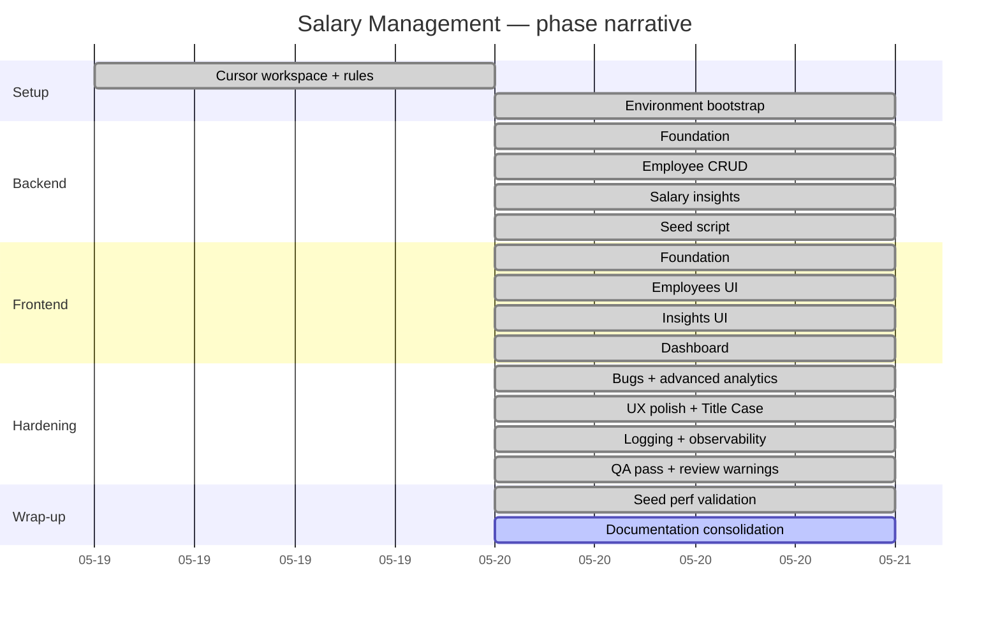

# Roadmap

A chronological narrative of how the Salary Management tool grew from
an empty repository to a deployed, demoable product. Phases are the
natural units of work the assessment was planned and shipped in — each
one began with a Plan-mode session, executed top-to-bottom as TDD
micro-tasks, and ended with a documentation sweep.

For per-task tables, see [implementation-phases.md](implementation-phases.md).
For decisions made along the way, see [tradeoffs-and-decisions.md](tradeoffs-and-decisions.md).

## Timeline at a glance



## Phase narrative

### Phase 0 — Cursor workspace bootstrap (commits `a77a983` → `23ced02`)

Set up the Incubyte-flavored Cursor workspace before any feature code
was written. Ported the framework-agnostic Cursor rules from a prior
project, wrote new rules for TDD discipline, craftsmanship, and commit
hygiene, and dropped in skills for the TDD loop, seed performance, and
SQL-query auditing. The full plan is in
[../../.cursor/plans/incubyte_cursor_setup_f53f25a7.plan.md](../../.cursor/plans/incubyte_cursor_setup_f53f25a7.plan.md).

**Outcome**: every later phase ran inside a workspace that knew the
Three Laws of TDD, SOLID, and Conventional Commits. See
[ai-assisted-workflow.md](ai-assisted-workflow.md) for the full
inventory.

### Phase 1 — Backend foundation (commits `871a1ee` → `eb1b58f`)

`pyproject.toml`, FastAPI app, Settings via `pydantic-settings`,
SQLAlchemy `Base` + engine + `get_db`, in-memory SQLite test fixtures,
global `DomainError` handler, table creation in lifespan, CORS for
`http://localhost:5173`. Eight micro-tasks, each a `test:` → `feat:`
pair.

### Phase 2 — Employee domain CRUD (~22 micro-tasks)

`Employee` model, Pydantic v2 schemas, repository, service, and the
full `POST/GET/PUT/DELETE /employees` surface with pagination, country
filter, name search, allow-listed sort, optional `email`/`department`/
`hire_date`/`is_active` fields, and `DuplicateEmployeeEmail → 409`
mapping.

### Phase 3 — Salary insights (~12 micro-tasks)

`SalaryInsightsService` with `average/min/max by country`, `average by
(country, title)`, top titles. Endpoints under `/insights/country/...`.
The "other meaningful metric" question went through the LLM Council
skill before locking on top-titles + global overview.

### Phase 4 — Seed script (~9 micro-tasks)

`app/db/seed.py` + `scripts/seed.py` CLI. Bulk insert via
`db.execute(insert(Employee), batch)` in 1000-row chunks, deterministic
via constructor-injected `random.Random(seed)`, `--reset` flag for
idempotency, opt-in `pytest -m perf` budget test. Initial 10k benchmark
recorded in [seed-performance-strategy.md](seed-performance-strategy.md).

### Phase 5 — Frontend foundation (~7 micro-tasks)

Vite + React 18 + TypeScript strict, Tailwind + shadcn primitives,
TanStack Query + React Router, Vitest + RTL + jsdom, typed `api()` +
`ApiError`, `employeesService` + `insightsService`. See
[frontend-architecture.md](frontend-architecture.md).

### Phase 6 — Employees UI (~15 micro-tasks)

`AppShell` (Stitch-assisted draft, then TDD-split), `EmployeesPage`
with `EmployeesTable`, `EmployeesFilters`, `Pagination`, create / edit
/ delete dialogs (RHF + Zod), toast on API error.

### Phase 7 — Insights UI (~10 micro-tasks)

`CountrySelect`, `KpiCards`, `TitleAveragesChart` (Recharts BarChart),
`InsightsPage` composes them with loading/empty/error states.

### Phase 8 — Dashboard (~6 micro-tasks)

`/insights/global` + `/insights/by-country/distribution` backend
endpoints; `DashboardPage` with KPI grid, country distribution chart,
recent hires list.

### Phase 9 — Bugs + advanced HR analytics (commits up to `516b339`)

Driven by the
[salary-mgmt bugs and analytics plan](../../.cursor/plans/salary-mgmt_bugs_and_analytics_2c8dd4b6.plan.md).
Fixed three defects (job-title case sensitivity, country case
sensitivity, Recharts Y-axis clipping); shipped three enhancements
(searchable `CountryCombobox`, pagination "of N" summary, advanced HR
analytics: compa-ratio, range penetration, payroll burden, NTILE
outliers). ~52 commits, each a `test:` immediately followed by a
`feat:` / `refactor:`.

### Phase 10 — UX polish + Title Case sweep (commits `3a39cc7` → `01f6f37`)

Driven by the
[insights-polish-ux-pass plan](../../.cursor/plans/insights-polish-ux-pass_c3887b4e.plan.md).
Reusable `<AnalyticsSection>`, `<InfoHint>` (Radix Tooltip), and
`<SummaryList>` primitives; vertical-stacked payroll layout;
TitleCase sweep across every user-visible heading. See
[ui-ux-decisions.md](ui-ux-decisions.md).

### Phase 11 — Logging + observability (separate plan)

Driven by the
[backend/frontend logging plan](../../.cursor/plans/backend_frontend_logging_implementation_7a69693d.plan.md).
JSON `JsonFormatter`, `RequestContextMiddleware` with `X-Request-ID`,
contextvar correlation, INFO logs on mutations, frontend logger +
`ErrorBoundary`. No new dependencies. Discussed in
[backend-architecture.md](backend-architecture.md) §Logging.

### Phase 12 — Review warnings + QA automation pass

Driven by the
[address-review-warnings plan](../../.cursor/plans/address-review-warnings_864a30e2.plan.md)
and a QA Automation agent run. Renamed `_filtered` → `apply_filters`,
added a characterization test for the `RequestContextMiddleware` error
path (which exposed a real bug — fixed), typed every service return
shape with `TypedDict`, modernized the SQLAlchemy 2.x `delete()` style
in tests, removed dead `_ALLOWED_SORT_VALUES`. The QA pass uncovered
a latent `ALLOWED_ORIGINS` JSON-array bug and a missing
`name-files-empty` characterization test — both fixed.

### Phase 13 — Seed perf validation (commits around `2026-05-20`)

Driven by the
[seed-10k-perf-validate plan](../../.cursor/plans/seed-10k-perf-validate_dcbc7a0c.plan.md).
Re-ran the 10k seed three times (mean **0.088 s**, ~57x under the 5 s
budget), produced a phase-level breakdown
(`scripts/_bench_seed.py`, not committed), and appended a dated
entry to [seed-performance-strategy.md](seed-performance-strategy.md).
Verdict: no architectural change needed; one nice-to-have noted for
the 100k+ regime.

### Phase 14 — Documentation consolidation (this folder)

You're reading the output of phase 14: collapsing the raw `.cursor/
plans/` audit trail and the older `artifacts/architecture/`,
`artifacts/tradeoffs.md`, and `artifacts/performance.md` files into a
single curated `artifacts/planning/` surface so a reviewer has one
canonical reading order. See [README.md](README.md) for the index.

## Commit-style summary

The full `git log` reads as alternating `test:` → `feat:` (with
periodic `refactor:` and small `docs:` / `chore:` entries). No commit
bundles a test, an implementation, and a refactor together — this is
the discipline the
[incubyte-commit-hygiene rule](../../.cursor/rules/incubyte-commit-hygiene.mdc)
enforces and the
[incubyte-code-reviewer agent](../../.cursor/agents/incubyte-code-reviewer.md)
audits.

```bash
# Quick audit
git log --oneline | head -40
```

## Where to go next

- For exact micro-tasks per phase → [implementation-phases.md](implementation-phases.md)
- For the AI workflow that produced this evolution → [ai-assisted-workflow.md](ai-assisted-workflow.md)
- For every decision made along the way → [tradeoffs-and-decisions.md](tradeoffs-and-decisions.md)
