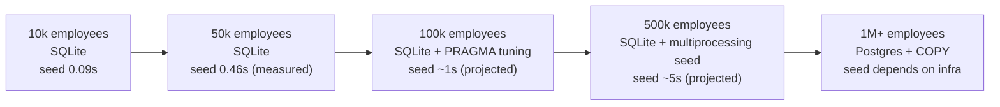

# Scalability Considerations

> The PDF asks for an HR tool that handles 10,000 employees. The
> current design comfortably handles that. This document maps the path
> from 10k → 50k → 100k → 1M with explicit intervention points so a
> reviewer can see what we did, what we deliberately didn't do, and
> what we'd do next.

For measured numbers at the assessment scale see
[seed-performance-strategy.md](seed-performance-strategy.md); for
analytics-specific complexity see [analytics-strategy.md](analytics-strategy.md);
for the SQLite-vs-Postgres argument see
[tradeoffs-and-decisions.md](tradeoffs-and-decisions.md) §"SQLite as
the primary database".

## Where the assessment is

| Dimension | Number |
|---|---|
| Employees | 10,000 |
| Seed wall-clock | **0.088 s** (mean of 3 samples) |
| Seed budget | 5 s — beaten ~57× |
| Insights query (10k) | < 5 ms (avg/min/max + payroll + NTILE) |
| List endpoint p99 | < 20 ms (paginated, indexed) |
| Frontend bundle | ~250 KB gz |

## The growth corridor

## Intervention points

### 10k → 50k (no code changes)

- **Measured**: 50k seed wall-clock is **0.46 s**, ~5× the 10k time.
  Pure linear scaling.
- **SQLite headroom**: 50k rows is ~8 MB on disk. Page cache holds
  the working set comfortably; no PRAGMA changes needed.
- **Insights queries**: still single-digit ms. Aggregates over 50k
  on indexed columns are not measurably different from 10k.
- **Frontend**: paginated table doesn't load the whole dataset; UI
  performance is unchanged.

**Verdict**: no intervention. The current design handles 50k as well
as it handles 10k.

### 50k → 100k (PRAGMA tuning, optional)

- **Projected seed**: ~1 s; insert path is `O(n)` with no surprises.
- **Optional**: set `PRAGMA synchronous=NORMAL` for the seed only.
  Reduces fsync cost without losing crash safety after the final
  commit. Reverts to `FULL` for normal operation.
- **Indexes**: `LOWER(job_title)` queries (analytics) start to be
  measurable — add a functional index on `lower(job_title)`. SQLite
  supports it; Postgres does too. Documented in
  [tradeoffs-and-decisions.md](tradeoffs-and-decisions.md)
  §"Case-insensitive job-title normalization".
- **NTILE outliers**: window functions are `O(n log n)` per partition.
  At 100k with ~400 distinct (country, title) partitions, total work
  is roughly 100k × log₂(250) ≈ 800k ops — still microseconds.

**Verdict**: one functional index, one PRAGMA toggle in the seed
script. No architecture change.

### 100k → 500k (process-level seed, denormalized analytics cache)

- **Seed bottleneck shifts** from SQLite to Python row generation
  (currently 27% of wall-time at 10k). At 500k it becomes the
  dominant cost. Switch to `multiprocessing.Pool` for row generation;
  inserts stay sequential to keep transaction semantics simple.
- **Insights queries**: `O(n)` aggregates start to be > 100 ms.
  Materialize the per-country and per-title rollups into a
  refreshable summary table; recompute on every write batch.
  Trade-off: stale-by-up-to-a-few-seconds aggregates vs sub-50 ms
  reads.
- **Pagination defaults**: `limit` already clamped at 500; UI default
  stays at 25–50. List endpoint p99 grows linearly with the active
  filter, which is bounded.
- **Frontend table**: still no virtualization needed — the user only
  ever sees one page. Investigate only if a future requirement forces
  500+ visible rows at once.

**Verdict**: seed parallelization + a single summary table. Still no
Postgres.

### 500k → 1M+ (migrate to Postgres + COPY)

- **SQLite ceiling**: single-writer limit (every write serializes
  through one DB file) and page-cache pressure (1M rows ≈ 160 MB +
  indexes). For a single-tenant assessment tool we don't approach
  this — but the architecture migrates cleanly:
  - Switch `DATABASE_URL` to Postgres.
  - Replace `Base.metadata.create_all` with Alembic.
  - Replace `db.execute(insert(Employee), batch)` with PG `COPY` for
    the seed.
  - Window functions, NTILE, `lower(...)` functional indexes — all
    work the same in Postgres.
- **Operational footprint** changes substantially: container,
  connection pool, backups. None of that is on the path for the
  assessment.

**Verdict**: at this scale, the application is no longer the same
project. Migrate when the user count justifies the operational
burden.

## What we deliberately didn't build

- **No table virtualization.** TanStack Table paginates server-side
  and the UI never renders > 50 rows at once. Adding virtualization
  preemptively would be a complexity tax.
- **No global Redis cache.** Insights queries are already <10 ms;
  caching saves milliseconds at the cost of stale-data semantics.
- **No async DB driver.** `aiosqlite` adds overhead with no
  throughput benefit for our workload.
- **No background worker / Celery.** The seed CLI is the only batch
  job and it runs in-process. Adding a worker tier would be operational
  weight without benefit.
- **No CDC / streaming pipeline.** A 10k-employee HR DB does not need
  Kafka.

## Frontend scalability

| Dimension | Current | At 100k | At 1M |
|---|---|---|---|
| Pagination | server-side, `limit ≤ 500` | unchanged | unchanged |
| Country combobox | distinct query per filter change | add 30 s TanStack stale time | full-text index on country in DB |
| Insights dashboard | re-fetch on country change | unchanged | unchanged (queries on rollup table) |
| Bundle size | ~250 KB gz | unchanged | code-split chart bundle |

## Operational scalability

- **Logging**: stdlib JSON to stdout. Fly captures it; the platform's
  log shipper handles volume. At 1M-employee scale, swap the
  `JsonFormatter` for OTLP via the same `request_id_var` contract —
  zero call-site changes. See
  [tradeoffs-and-decisions.md](tradeoffs-and-decisions.md)
  §"Structured logging with stdlib".
- **Health**: `GET /` is the sanity check; add `/healthz` with a
  cheap DB ping if a load balancer requires it.
- **Deploy**: single uvicorn process today. Horizontal scaling
  requires either Postgres or a shared SQLite-via-LiteFS setup; not in
  scope.

## Summary table

| Scale | Backend change | Frontend change | Ops change |
|---|---|---|---|
| 10k | none (current) | none (current) | none (current) |
| 50k | none | none | none |
| 100k | one functional index + PRAGMA toggle | none | none |
| 500k | seed parallelization + summary table | none | none |
| 1M+ | Postgres + Alembic + COPY | maybe code-split | proper ops tier |

## See also

- [seed-performance-strategy.md](seed-performance-strategy.md) — the
  measured baseline this projection extends.
- [analytics-strategy.md](analytics-strategy.md) — where the window
  function complexity lives.
- [tradeoffs-and-decisions.md](tradeoffs-and-decisions.md) — why
  SQLite is the right starting point even when scaling further is
  on the table.
